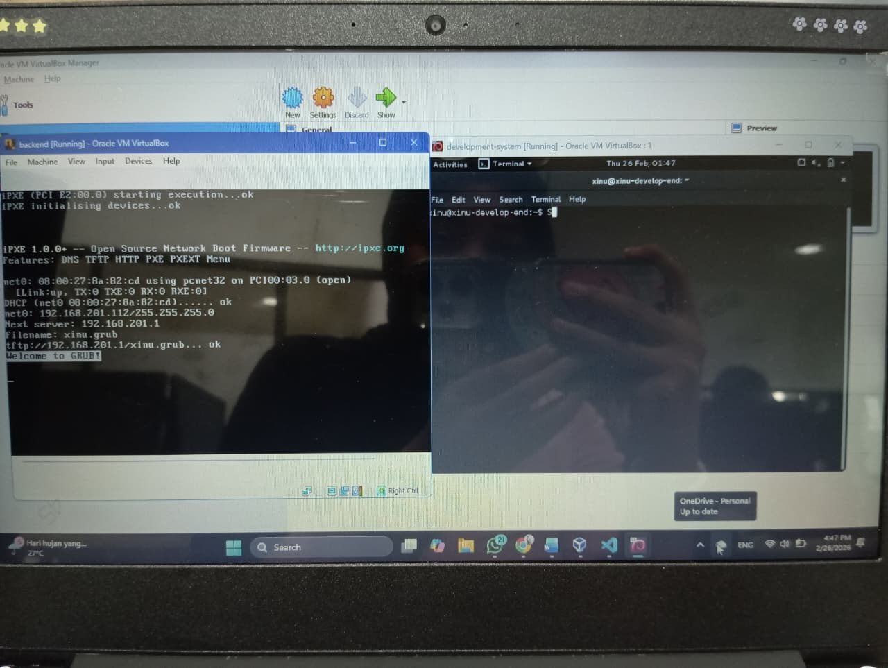

# <h1 align="center">Laporan Praktikum Modul 2  Instalasi Xinu </h1>

Novita Syahwa Tri Hapsari - 2311104007

## Dasar Teori
XINU
XINU ("X is Not Unix") adalah kernel sistem operasi komputer yang dikembangkan di Apple Inc. sejak Desember 1996 untuk digunakan dalam sistem operasi Mac OS X (sekarang macOS) dan dirilis sebagai perangkat lunak bebas dan sumber terbuka sebagai bagian dari OS Darwin

Oracle VM VirtualBox
Oracle VM VirtualBox adalah perangkat lunak virtualisasi lintas platform (open-source) yang memungkinkan Anda untuk menjalankan beberapa sistem operasi secara bersamaan di dalam satu komputer fisik.

## Guided
Foto hasil instalasi xinu dan running Oracle VM VirtualBox
 

## Referensi

1. https://share.google/di5IoOeGs83Fkxl0c (oracle vm virtual box)
2. https://id.wikipedia.org/wiki/XNU (xinu)