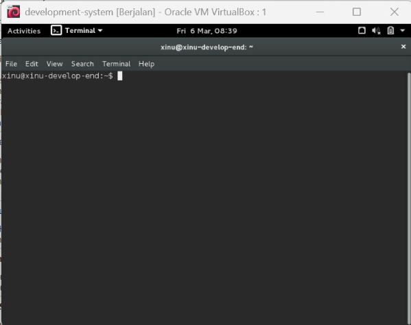
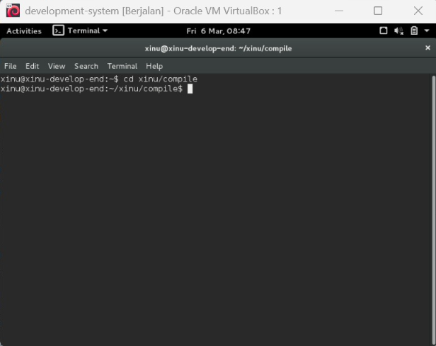
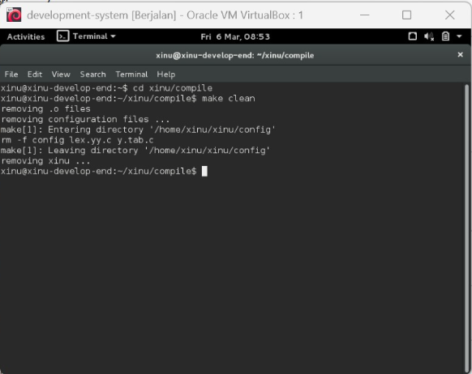
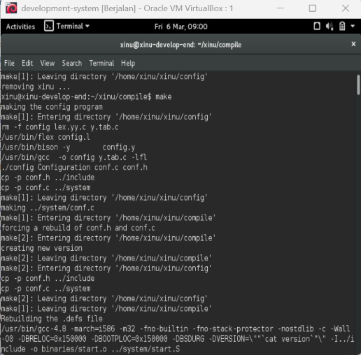
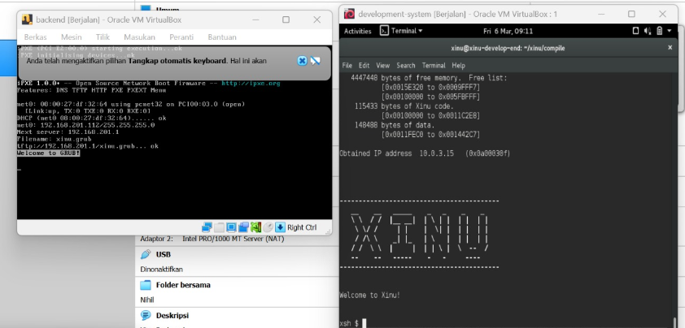
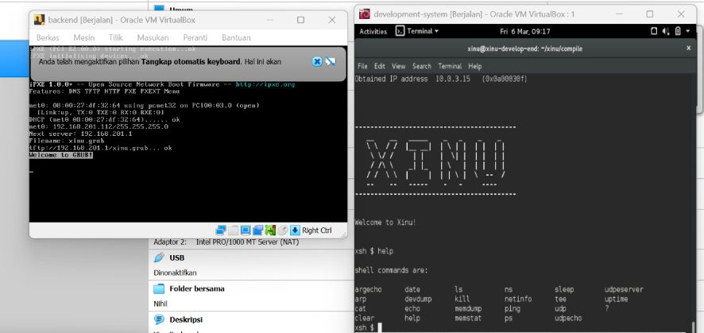
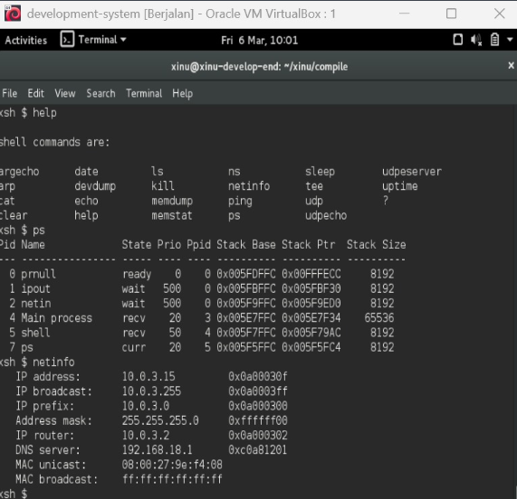

# <h1 align="center">Laporan Praktikum Modul 3  Explorasi Xinu </h1>

Novita Syahwa Tri Hapsari - 2311104007

## Dasar Teori
# Konsep Dasar Sistem Operasi

### a. Command Line Interface (CLI)
Tampilan berbasis teks yang memungkinkan pengguna berkomunikasi langsung dengan sistem operasi melalui perintah yang diketik menggunakan keyboard. Biasanya digunakan melalui terminal, command prompt, atau shell, dan hingga kini masih menjadi alat utama untuk banyak administrator sistem, developer, dan pengguna tingkat lanjut.

### b. Shell
Merupakan komponen krusial yang berfungsi sebagai perantara antara pengguna dan kernel dari sistem operasi. Ia bertindak sebagai pengurai dan penafsir perintah yang biasanya dimasukkan melalui terminal, mengubah instruksi tekstual menjadi tindakan eksekusi oleh sistem.

### c. Struktur Direktori pada Sistem Operasi
Direktori root merupakan akar dari semua direktori dan file di sistem Linux. Semua direktori lain berada di bawah direktori ini. Perintah seperti `cd` digunakan untuk berpindah dari satu direktori ke direktori lain.

### d. Proses Kompilasi Program
Proses menerjemahkan kode sumber yang ditulis oleh seorang programmer menjadi kode mesin yang dapat dieksekusi oleh komputer. Penerjemahan ini dilakukan oleh program khusus yang disebut **kompiler**.

### e. Proses Booting Sistem Operasi
Proses menyalakan komputer dan memuat sistem operasi ke dalam memori utama (RAM) sehingga komputer siap digunakan. Istilah “booting” berasal dari kata **bootstrap**, yang bermakna memulai sesuatu dari awal.

## Guided
Langkah langkah :

### 1. Jalankan VirtualBox
Buka **VirtualBox** dan start VM **development-system.ova**.

### 2. Login ke VM
Masuk ke VM menggunakan password:  xinurocks
- Setelah berhasil login, akan muncul terminal default seperti pada gambar: 
 
  
### 3. Tuliskan "cd xinu/compile" pada terminal untuk pindah ke directory xinu dan enter untuk menjalankan perintah. Fungsi nya untuk pindah direktori ke xinu, tampilan seperti gambar berikut :
 

### 4. tuliskan "make clean" pada terminal untuk menghapus file kompilasi sebelumnya, tampilan seperti gambar berikut :
 

### 5. ketik "make" pada terminal untuk melakukan proses kompilasi source code jadi file yang bisa dijalankan sistem, tampilan seperti gambar:
 

### 6. ketik "sudo minicom" untuk menjalankan aplikasi minicom sebagai alat komunikasi melalui serial port sehingga kita bisa interaksi dengan sistem xinu yang berjalan pada backend vm, ketika sudah dienter akan diarahkan ke isi password yaitu kita isi xinurocks. Tampilan seperti gambar berikut :
 

### 7. setelah itu jalankan backend di virtualbox dan ketik perintah "help" di terminal untuk menampilkan semua perintah xinu, tampilan seperti gambar berikut :
 

##Unguided

1. **Jumlah perintah pada Xinu**  
   - 23 perintah  
   - Dapat dilihat menggunakan perintah `help` pada shell Xinu.

2. **Dua perintah dengan fungsi yang sama**  
   - `help` dan `?`  
   - Keduanya digunakan untuk menampilkan bantuan atau daftar perintah pada Xinu.

3. **IP address Xinu**  
   - `10.0.3.15`  
   - Dapat dilihat menggunakan perintah `netinfo` pada shell Xinu.

4. **Perintah untuk mengetahui IP address**  
   - `netinfo`

5. **IP DNS server yang digunakan oleh Xinu**  
   - `192.168.18.1`  
   - Dapat dilihat menggunakan perintah `netinfo` pada shell Xinu.

6. **Jumlah proses yang sedang berjalan pada Xinu**  
   - 7 proses  
   - Dapat dilihat menggunakan perintah `ps` pada shell Xinu.

7. **Proses dengan prioritas paling rendah**  
   - `prnull`

8. **Proses dengan ukuran paling besar**  
   - `Main process` dengan stack size **65536**

9. **Proses yang berada dalam state `current`**  
   - `ps`

10. **Proses yang berada dalam state `suspend`**  
    - Tidak ada proses dalam state `suspend`  
    - Hanya terdapat state: `ready`, `wait`, `recv`, dan `curr`.

11. **PID (Process ID) dari Main process**  
    - 4
    
     

## Referensi

1. https://share.google/di5IoOeGs83Fkxl0c (oracle vm virtual box)
2. https://id.wikipedia.org/wiki/XNU (xinu)
