# <h1 align="center">Laporan Praktikum Modul 4  Membaca Source Code Xinu </h1>

Novita Syahwa Tri Hapsari - 2311104007

## Dasar Teori
### a. Paradigma Embedded pada Xinu
Xinu ditujukan untuk sistem embedded, sehingga menggunakan paradigma **cross-development**.  
Dalam paradigma ini, developer (programmer) menggunakan komputer standar dengan sistem operasi umum seperti Linux atau Windows untuk mengembangkan dan mengompilasi program yang nantinya dijalankan pada perangkat target (embedded system).

### b. Bahasa Pemrograman pada Xinu
Xinu ditulis menggunakan bahasa **C**, sama seperti banyak sistem operasi lainnya seperti Unix, Linux, dan macOS.  
Penggunaan bahasa C memungkinkan efisiensi serta kontrol langsung terhadap perangkat keras.

### c. Organisasi Source Code Xinu
Struktur direktori pada Xinu terdiri dari beberapa folder penting berikut:

- `/compile` → Berisi proses dan file untuk kompilasi
- `/system` → Berisi kernel Xinu
- `/include` → Berisi header file
- `/shell` → Berisi perintah-perintah shell
- `/device` → Berisi driver perangkat
- `/lib` → Berisi fungsi library
- `/net` → Berisi fungsi jaringan

Struktur ini membantu pengorganisasian kode agar bersifat modular dan mudah dikembangkan.

### d. File Utama pada Xinu
Beberapa file penting dalam Xinu antara lain:

- `kernel.h` → Deklarasi kernel
- `process.h` → Struktur proses
- `conf.h` dan `conf.c` → Konfigurasi sistem
- `initialize.c` → Inisialisasi sistem

## Guided
Hasil screenshot setiap langkah langkah yang dikerjakan hingga tampilan output akhir

1. membuat new project dengan mengisikan nim_nama dan lokasi project

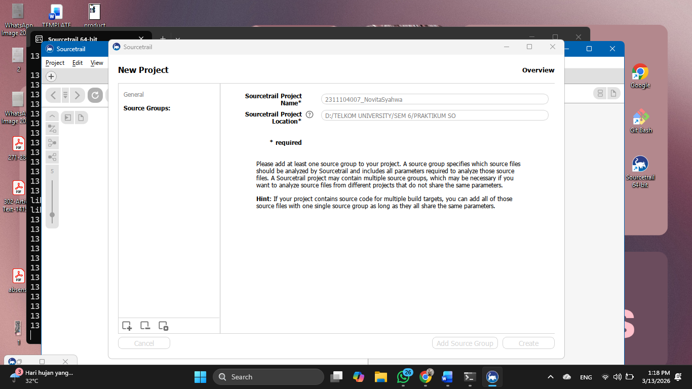 

2. pilih bahasa C dan empety C source group  

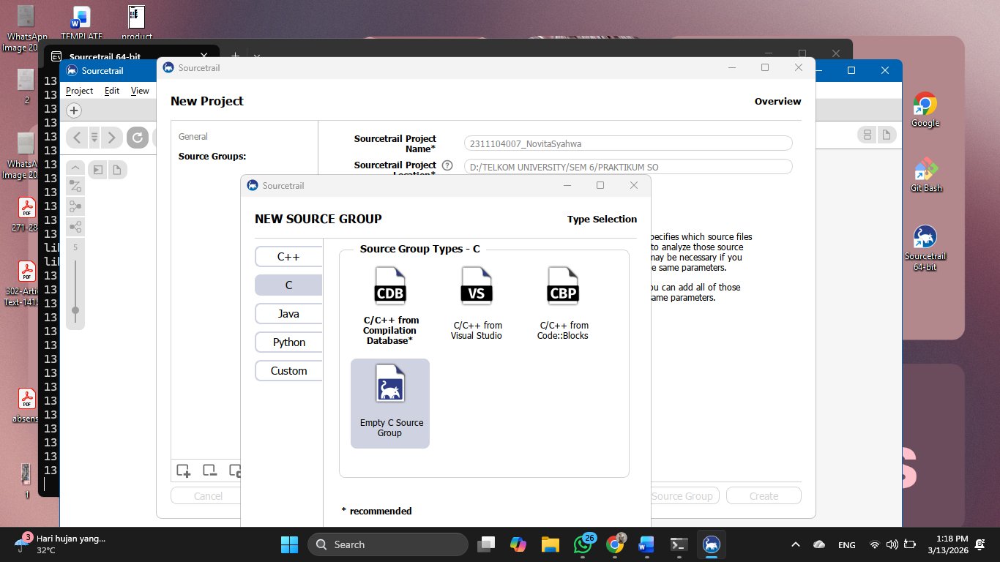 

3. pilih file & direction to index untuk file xinu-vbox nya   

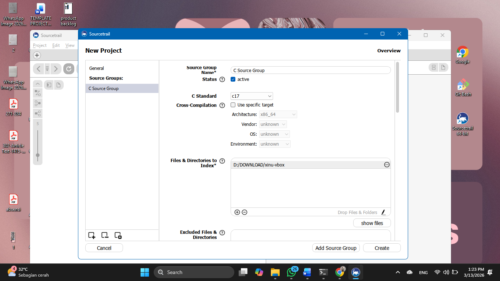 

4. pada bagian source file extention klik icon plus lalu tuliskan .S  

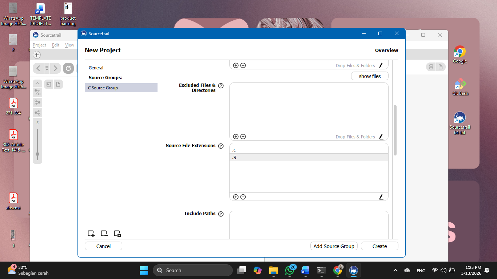 

5. lalu include path nya di klik auto detected  

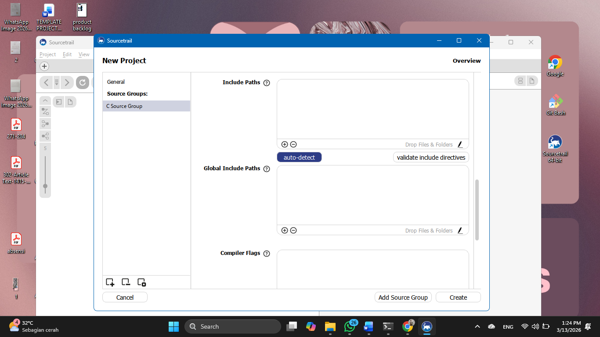 

6. setelah itu pilih start   

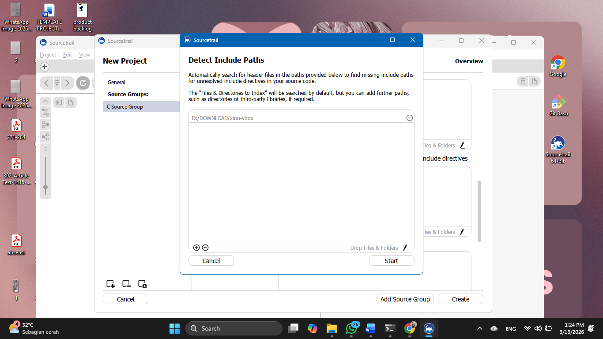 

7. lalu  klik add dan setelah itu klik create   

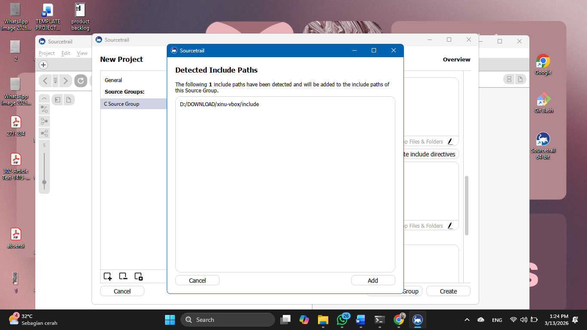 

8. klik start  

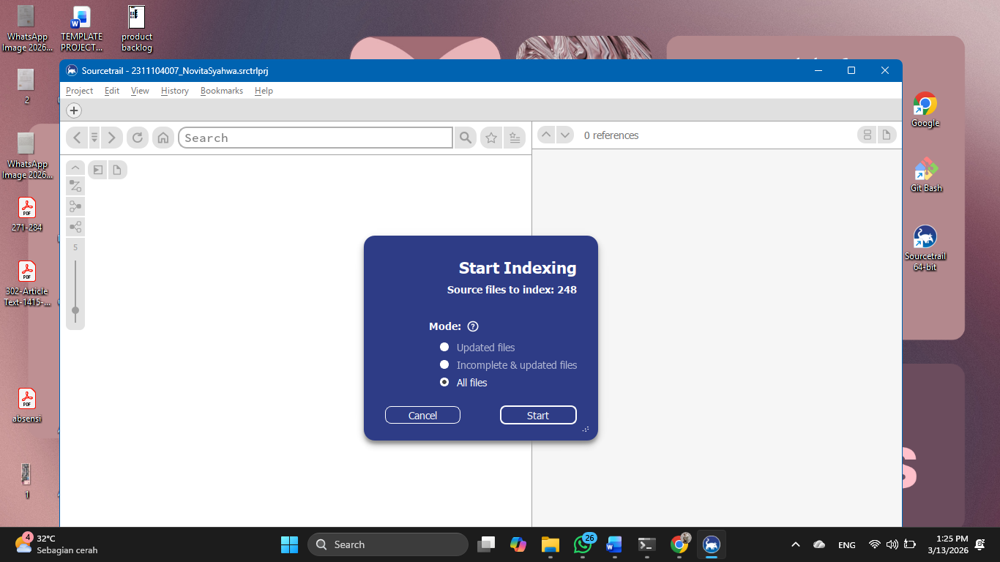 

9. akan muncul halaman utamanya seperti gambar di bawah ini  

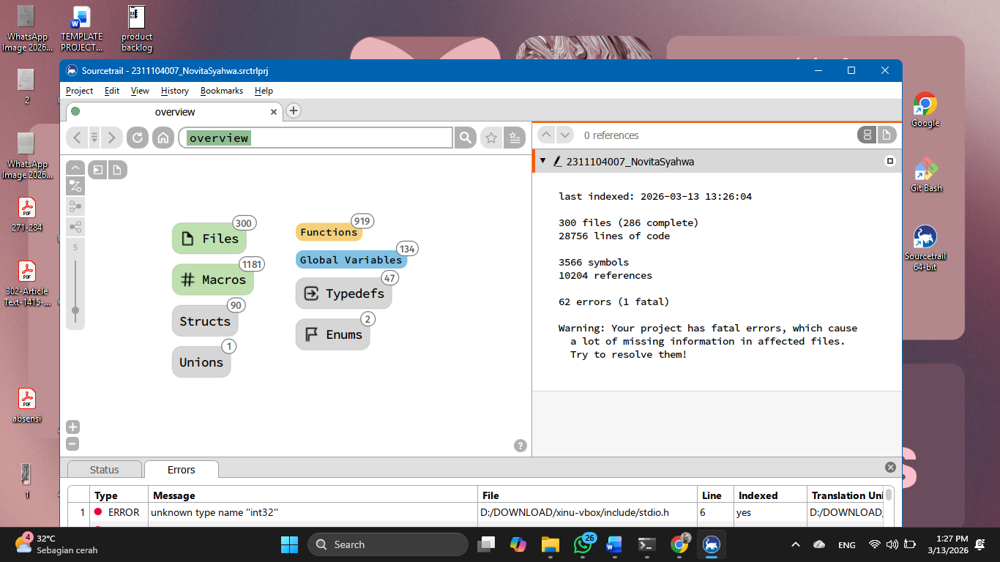 

10. lalu kita coba cari salah satu file yaitu xsh_kill.cp  

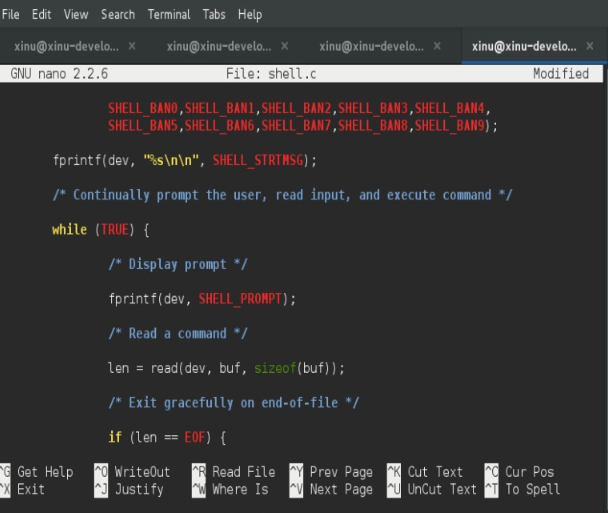 

## Unguided
### 1. Nama dan Lokasi File Image Hasil Kompilasi

- **Nama file:** `xinu.elf`  
- **Lokasi folder:** `/compile`  
- **Ukuran file:** Bervariasi tergantung sistem, biasanya beberapa ratus KB  
- **Keterangan:** File ini dihasilkan setelah melakukan proses kompilasi source code Xinu.

*Contoh tampilan file di terminal:*  

### 2. Carilah struktur data dari proses pada Xinu OS. Struktur data proses ada pada file apa? Informasi apa saja yang disimpan dalam struktur data tersebut?

Jawab :
Struktur data proses pada Xinu terdapat pada file process.h (di folder /include).
Struktur ini biasanya berupa struct procent yang menyimpan informasi seperti:
- **PID (Process ID)** – Nomor unik setiap proses  
- **State proses** – Status proses saat ini (misal: ready, wait, curr, suspend)  
- **Priority** – Prioritas eksekusi proses  
- **Stack pointer** – Penunjuk posisi stack saat proses berjalan  
- **Stack size** – Ukuran memori stack yang dialokasikan untuk proses  
- **Name proses** – Nama atau identifier proses  
- **Message** – Pesan yang dikirim atau diterima proses  
- **Parent process** – Proses induk yang membuat proses tersebut

### 3. Modifikasi Welcome Banner Xinu

## a. Carilah file yang menyimpan banner Xinu! Hint: file berekstensi .h pada direktori xinu/include
Jawab:
File yang menyimpan banner Xinu terdapat pada file shell.h di direktori /include. File ini berisi string banner yang akan ditampilkan pada saat sistem dijalankan. Untuk melihat isi file tersebut digunakan perintah: cd xinu/include lalu nano shell.h
 

## b. Carilah file yang menyimpan banner Xinu! Hint: file berektensi .c pada direktori xinu/shell
Jawab:
Untuk mengetahui file yang menampilkan banner Xinu, dilakukan dengan membuka file shell.c pada direktori /shell menggunakan perintah: cd xinu/shell lalu nano shell.c Pada file ini  ditemukan bahwa banner Xinu ditampilkan menggunakan fungsi fprintf yang mencetak string SHELL_STRMSG ke layar
 

## c. Modifikasi welcome banner Xinu
Modifikasi welcome banner pada Xinu dilakukan dengan mengubah isi file `shell.h` yang berada pada direktori `/include`. File ini berisi string banner utama (`SHELL_STRMSG`) serta tampilan ASCII art (`SHELL_BAN0` hingga `SHELL_BAN9`).
- Masuk ke direktori include:
- Buka file `shell.h` menggunakan text editor:
- Lakukan perubahan pada bagian berikut:
#define SHELL_BAN1 "------------Noivita Syahwa ------------"
#define SHELL_BAN8 "------------ 2311104007 ----------------"
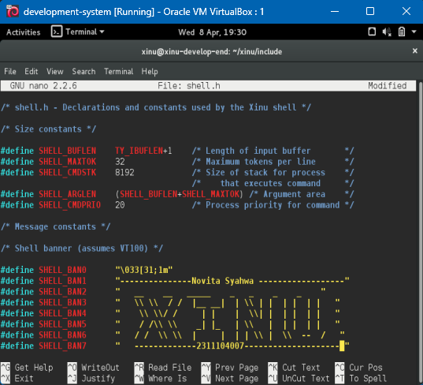

## d. Compile dan menjalankan xinu
- Setelah modifikasi selesai dilakukan, langkah berikutnya adalah melakukan proses kompilasi ulang dan menjalankan sistem Xinu untuk melihat hasil perubahan banner.
- Langkah-langkah yang dilakukan: cd ../compile make clean make sudo minicom
- Setelah itu, virtual machine backend dijalankan kembali agar sistem Xinu dapat dieksekusi. Hasilnya, banner yang ditampilkan pada layar telah berubah sesuai dengan modifikasi yang telah dilakukan, yaitu menampilkan teks tambahan serta nama dan NIM pada bagian ASCII banner.
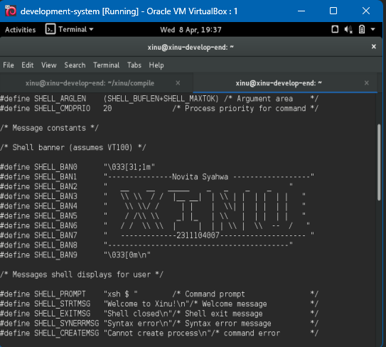

## Referensi

1. https://share.google/di5IoOeGs83Fkxl0c (oracle vm virtual box)
2. https://id.wikipedia.org/wiki/XNU (xinu)
