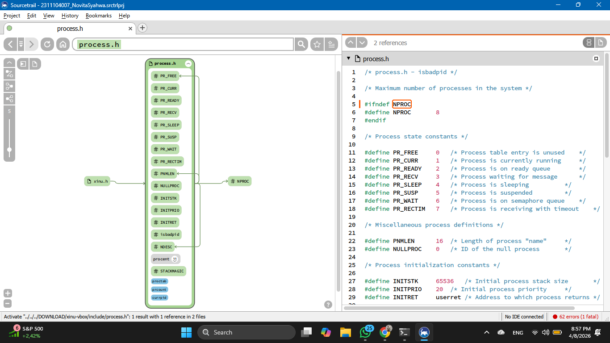

# <h1 align="center">Laporan Praktikum Modul 5  Explorasi Proses </h1>

Novita Syahwa Tri Hapsari - 2311104007

## Dasar Teori
 ### 5.1 Proses
Sistem operasi menyimpan semua informasi mengenai proses yang sedang berjalan dalam suatu struktur data yang disebut **process table**.  
Setiap proses direpresentasikan sebagai satu entri dalam process table tersebut.
Entri pada process table akan dibuat saat proses diciptakan (created) dan akan dihapus ketika proses diterminasi (terminated).
Pada Xinu, process table diimplementasikan menggunakan array global bernama `proctab[]`.  
Deklarasi `proctab[]` dapat ditemukan pada file `./include/process.h`.
Pada source code `process.h`, digunakan keyword `extern` yang menunjukkan bahwa array `proctab[]` bersifat global, sehingga dapat diakses oleh berbagai fungsi di seluruh sistem.
Xinu menggunakan **implicit data structure**, yaitu tidak secara eksplisit membuat field ID sebagai bagian dari struktur proses (`struct procent`).  
Sebagai gantinya, **process ID (PID)** direpresentasikan sebagai indeks pada array `proctab[]`.  
Contohnya, ketika Xinu mengakses `proctab[3]`, hal tersebut berarti Xinu sedang mengakses proses dengan **PID = 3**.  
Melalui entri tersebut, Xinu dapat memanipulasi atribut proses, seperti nilai prioritas, yang tersimpan dalam `struct procent`.

## Guided
 
