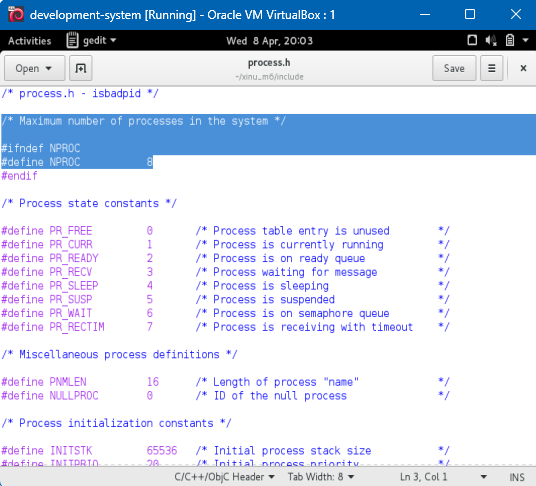
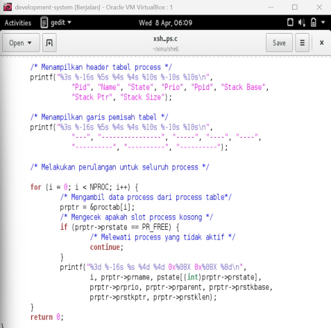
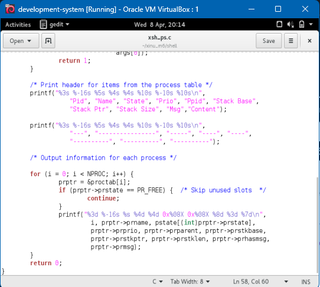
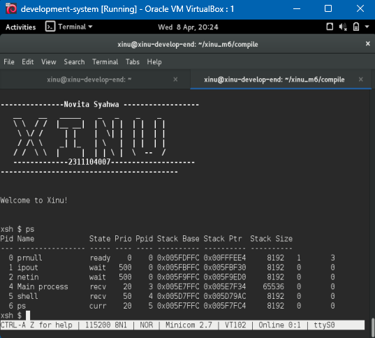
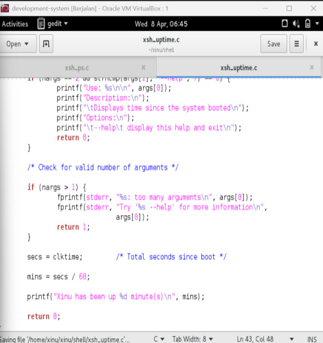
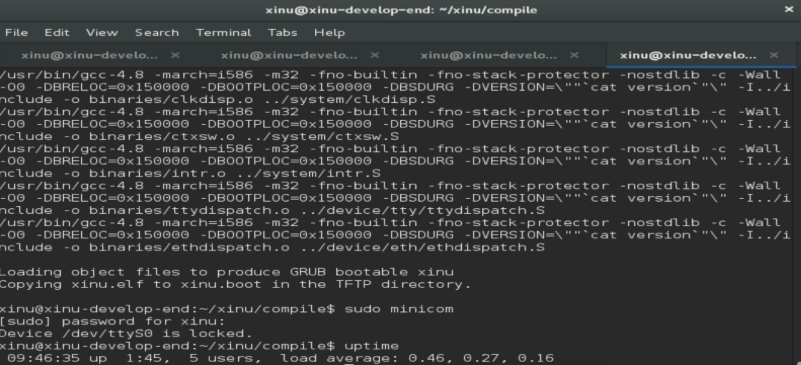

# <h1 align="center">Laporan Praktikum Modul 5<br> Explorasi Proses </h1>
<p align="center">Novita Syahwa Tri Hapsari - 2311104007</p>

## Dasar Teori
 ### 5.1 Proses
Sistem operasi menyimpan semua informasi mengenai proses yang sedang berjalan dalam suatu struktur data yang disebut **process table**.  
Setiap proses direpresentasikan sebagai satu entri dalam process table tersebut.
Entri pada process table akan dibuat saat proses diciptakan (created) dan akan dihapus ketika proses diterminasi (terminated).
Pada Xinu, process table diimplementasikan menggunakan array global bernama `proctab[]`.  
Deklarasi `proctab[]` dapat ditemukan pada file `./include/process.h`.
Pada source code `process.h`, digunakan keyword `extern` yang menunjukkan bahwa array `proctab[]` bersifat global, sehingga dapat diakses oleh berbagai fungsi di seluruh sistem.
Xinu menggunakan **implicit data structure**, yaitu tidak secara eksplisit membuat field ID sebagai bagian dari struktur proses (`struct procent`).  
Sebagai gantinya, **process ID (PID)** direpresentasikan sebagai indeks pada array `proctab[]`.  
Contohnya, ketika Xinu mengakses `proctab[3]`, hal tersebut berarti Xinu sedang mengakses proses dengan **PID = 3**.  
Melalui entri tersebut, Xinu dapat memanipulasi atribut proses, seperti nilai prioritas, yang tersimpan dalam `struct procent`.

## Guided
 

## Unguided
## 1. jawbalah pertanyaan berikut ini :
a. Berapa banyaknya maksimum proses yang ada pada Xinu?
jawaban: Gambar tersebut menunjukan jumlah maksimum proses yang dapat dijalankan dalam sistem Xinu. Secara default, nilai NPROC adalah 8, artinya hanya delapan proses yang bisa aktif dalam satu waktu, termasuk proses utama dan proses null. Nilai ini bisa diubah sesuai kebutuhan sistem.


b. Berapa maksimal panjang nama suatu proses pada Xinu? 
Jawaban: Maksimal panjang nama proses pada Xinu adalah 16 karakter.
PNMLEN menentukan panjang maksimum nama proses.
NULLPROC adalah proses khusus yang selalu berjalan ketika tidak ada proses lain yang aktif. Dengan kata lain, NULLPROC memastikan CPU tidak pernah benar-benar idle. c.

c. Berapa nilai prioritas awal pada saat proses dibuat?
Jawaban: Nilai prioritas awal proses saat dibuat adalah 20.
Nilai-nilai di atas digunakan saat proses baru dibuat. Mereka menentukan ukuran stack yang digunakan proses, prioritas awalnya, dan alamat fungsi yang akan dipanggil ketika proses selesai dieksekusi. 

d. Ada berapa total state pada Xinu? Sebutkan!
Jawaban : Total state pada Xinu ada 7, yaitu PR_FREE, PR_CURR, PR_READY, PR_RECV, PR_SLEEP, PR_SUSP, dan PR_WAIT.
Konstanta-konstanta ini mendefinisikan status dari setiap proses yang ada dalam sistem. Status ini disimpan di tabel proses dan digunakan oleh kernel untuk menentukan tindakan berikutnya terhadap proses tersebut.
note : masuk ke folder xinu lalu ketik "gedit include/process.h

## 2. Perintah ps adalah perintah untuk menampilkan statistik process yang berjalan. Source code dari ps tersimpan pada file xsh_ps.c. Carilah file tersebut dan beri komentar pada 20 baris terakhir di source code tersebut! 
jawab:
Komentar ditambahkan pada 20 baris terakhir file `xsh_ps.c` untuk menjelaskan fungsi setiap bagian kode pada implementasi perintah `ps`. Bagian yang diberi komentar meliputi pencetakan header tabel, perulangan process table, pengecekan state proses, dan pencetakan informasi setiap proses. Penambahan komentar bertujuan agar source code lebih mudah dipahami.
- Langkah pengerjaan:
  - Membuka file `xsh_ps.c` pada folder `xinu/shell/`
  - Ketik perintah:
    ```
    cd ~/xinu/shell
    ```
  - Tambahkan komentar sebelum blok / baris terkait
  - Klik save
   

## 3. Ubahlah perintah ps (source code: xsh_ps.c) pada Xinu sehingga menampilkan informasi tambahan berupa kolom yang berisi total message yang ada pada proses seperti gambar di bawah ini:
Msg adalah banyaknya pesan yang ada dalam proses. Kolom Content adalah isi dari pesan tersebut. Langkah pengerjaan:
- Langkah pengerjaan:
  - Modifikasi source code pada file `xsh_ps.c`
  - Kompilasi ulang Xinu dengan perintah seperti pada modul sebelumnya
  - Jalankan Backend VM
  - Setelah sistem berjalan, jalankan perintah $ps. Pastikan hasilnya sesuai dengan contoh output pada gambar yang diberikan.
  - Screenshot source kode dan output akhir hasil modifikasi
 
 

## 3. Ubahlah perintah uptime pada Xinu sehingga menampilkan lamanya Xinu sejak booting hanya dalam satuan menit.
- Langkah pengerjaan:
  - Modifikasi source code pada file `xsh_uptime.c`
  - Kompilasi ulang Xinu dengan perintah seperti pada modul sebelumnya
  - Jalankan Backend VM
  - Setelah sistem berjalan, jalankan perintah $uptime
  - Pastikan hasilnya sesuai dengan contoh output yang diinginkan
  - Screenshot source kode dan output akhir hasil modifikasi
 

 Perintah uptime dimodifikasi agar hanya menampilkan waktu aktif sistem dalam satuan menit. Perhitungan dilakukan dengan membagi nilai `clktime` dengan 60 untuk memperoleh total menit sejak sistem booting. Output ditampilkan dalam format menit sesuai ketentuan praktikum
- Langkah pengerjaan:
  - Membuka file `xsh_uptime.c` pada folder `xinu/shell/`
  - Ketik perintah:
    ```
    gedit xsh_uptime.c
    ```
  - Cari bagian perhitungan uptime (biasanya `secs = clktime;`)
  - Edit sesuai dengan gambar yang diberikan
  - save dan compile ulang dari cd xinu/compile sampe sudo minicom
  - tuliskan uptime
  


