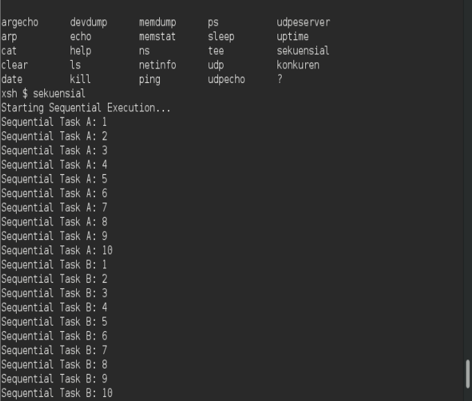
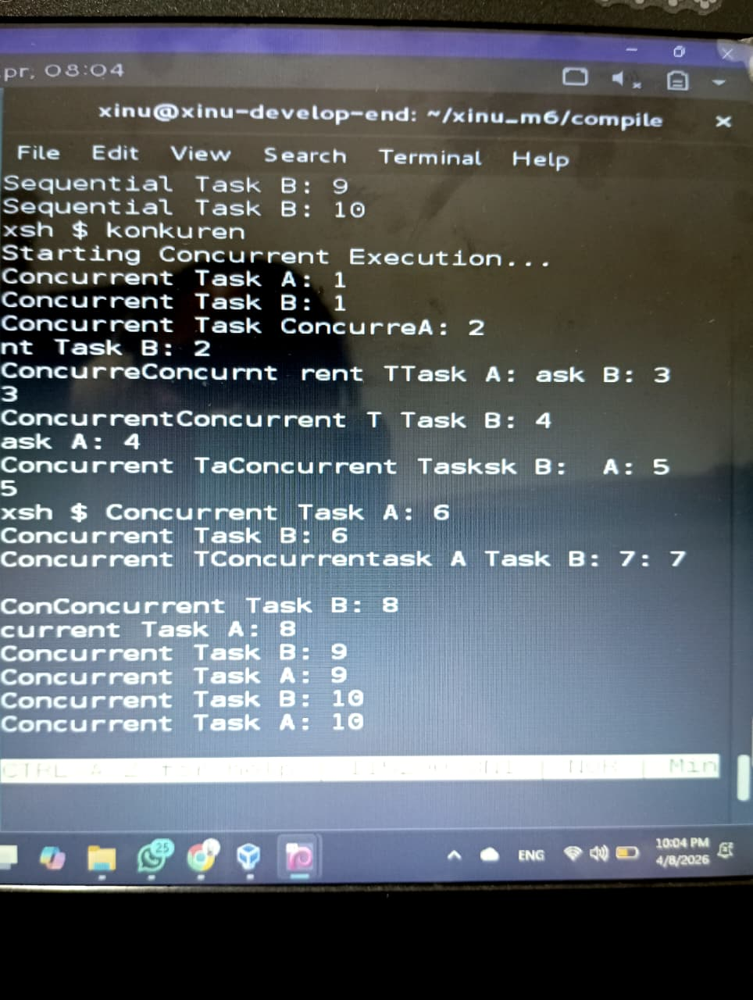

# <h1 align="center">Laporan Praktikum Modul 6<br> Sekuensial dan Konkuren </h1>
<p align="center">Novita Syahwa Tri Hapsari - 2311104007</p>

## Dasar Teori
 ### Pendahuluan
Pada dasarnya, komputer mengeksekusi instruksi satu per satu dalam suatu urutan tertentu. Hal ini disebut sebagai eksekusi **sekuensial**, di mana setiap perintah dijalankan secara berurutan sesuai dengan alur program yang telah ditentukan.

Dalam pemrograman, fungsi atau statement yang ditulis biasanya akan dieksekusi secara sekuensial, mulai dari baris pertama hingga baris terakhir. Model ini sederhana dan mudah dipahami karena alur eksekusinya jelas dan terstruktur.

Namun, dalam sistem operasi modern, terdapat konsep **konkuren (concurrent)**, yaitu kemampuan sistem untuk menjalankan beberapa proses atau tugas secara bersamaan dalam satu waktu. Meskipun secara fisik prosesor mengeksekusi instruksi satu per satu, sistem operasi dapat mengatur pembagian waktu eksekusi (time-sharing) sehingga beberapa proses seolah-olah berjalan secara paralel.

Pada modul ini, dipelajari perbedaan antara eksekusi sekuensial dan konkuren, serta bagaimana sistem operasi mengelola banyak proses secara efisien. Pemahaman konsep ini sangat penting dalam pengembangan perangkat lunak, terutama untuk meningkatkan performa dan responsivitas sistem.

## Guided
 
<p> SEQUENTIAL </p>

 
<p> KONKUREN </p>

## Unguided

### 1. Jawablah pertanyaan berikut ini:

### a. Berapa banyaknya maksimum proses yang ada pada Xinu?
Maksimum jumlah proses pada Xinu ditentukan oleh konstanta `NPROC` yang didefinisikan pada file konfigurasi.  
Umumnya, nilai `NPROC` adalahadalah 8  yang didefinisikan dengan konstanta `define NPROC 8`

### b. Berapa maksimal panjang nama suatu proses pada Xinu?
Panjang maksimum nama proses pada Xinu ditentukan oleh konstanta `PNMLEN`.  
Biasanya, nilai `PNMLEN` adalah **16 karakter** (termasuk null terminator).

### c. Berapa nilai prioritas awal pada saat proses dibuat?
Nilai prioritas awal proses pada Xinu ditentukan saat pemanggilan fungsi `create()`.  
Secara umum, nilai default yang sering digunakan adalah **20**, namun dapat disesuaikan sesuai kebutuhan saat proses dibuat.

### d. Ada berapa total state pada Xinu? Sebutkan!
Xinu memiliki beberapa state (keadaan) proses, yaitu:

1. `PR_FREE` → Proses tidak digunakan (kosong)
2. `PR_CURR` → Proses sedang berjalan (running)
3. `PR_READY` → Proses siap dijalankan (ready)
4. `PR_RECV` → Proses sedang menunggu pesan (receive)
5. `PR_SLEEP` → Proses sedang tidur (sleep)
6. `PR_SUSP` → Proses dalam keadaan suspend (ditangguhkan)
7. `PR_WAIT` → Proses menunggu semaphore

Sehingga total terdapat **7 state proses** pada Xinu.

## 2. Perintah `ps` pada Xinu

Perintah `ps` digunakan untuk menampilkan informasi proses yang sedang berjalan pada sistem Xinu.  
Source code berada pada file `xsh_ps.c`.

Berikut adalah **20 baris terakhir** dari source code beserta komentarnya:

```c
    /* Output information for each process */

    // Melakukan perulangan untuk seluruh proses dalam process table
    for (i = 0; i < NPROC; i++) {

        // Mengambil alamat (pointer) dari proses ke-i
        prptr = &proctab[i];

        // Jika state proses adalah FREE (tidak digunakan), maka dilewati
        if (prptr->prstate == PR_FREE) {
            continue;
        }

        // Menampilkan informasi proses:
        // PID, nama, state, prioritas, parent PID, base stack, pointer stack, ukuran stack
        printf("%3d %-16s %s %4d %4d 0x%08X 0x%08X %8d\n",

            // Menampilkan PID (index array)
            i,

            // Menampilkan nama proses
            prptr->prname,

            // Menampilkan state proses dalam bentuk string
            pstate[(int)prptr->prstate],

            // Menampilkan prioritas proses
            prptr->prprio,

            // Menampilkan parent process ID
            prptr->prparent,

            // Menampilkan alamat awal stack
            prptr->prstkbase,

            // Menampilkan pointer stack saat ini
            prptr->prstkptr,

            // Menampilkan ukuran stack
            prptr->prstklen
        );
    }

    // Mengembalikan nilai 0 sebagai tanda eksekusi berhasil
    return 0;
}
