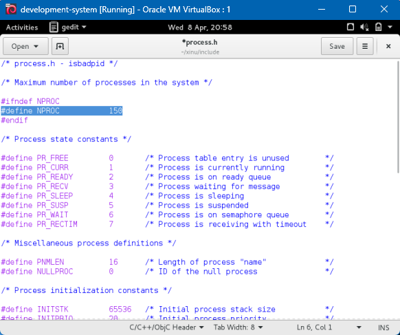
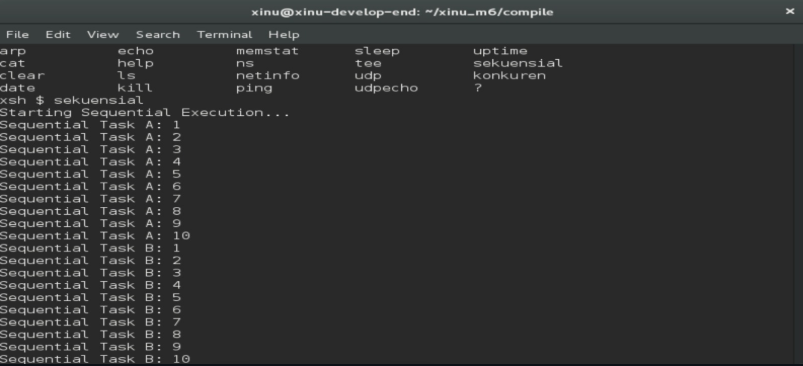
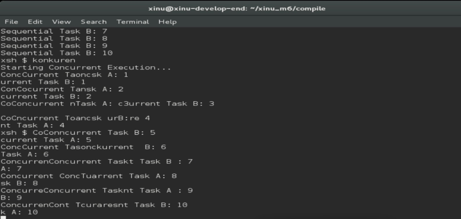
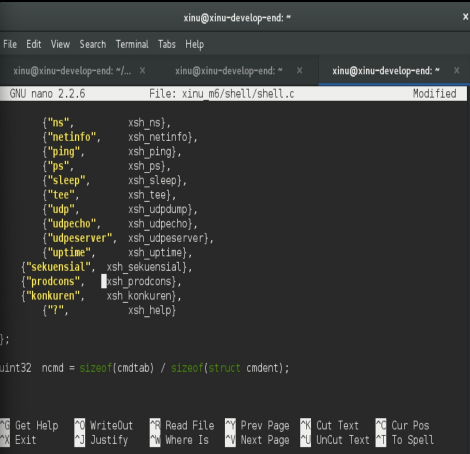
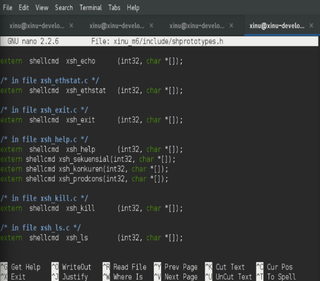

# <h1 align="center">Laporan Praktikum Modul 6  Sekuensial dan Konkuren </h1>

Novita Syahwa Tri Hapsari - 2311104007

## Dasar Teori
 ### Pendahuluan
Pada dasarnya, komputer mengeksekusi instruksi satu per satu dalam suatu urutan tertentu. Hal ini disebut sebagai eksekusi **sekuensial**, di mana setiap perintah dijalankan secara berurutan sesuai dengan alur program yang telah ditentukan.

Dalam pemrograman, fungsi atau statement yang ditulis biasanya akan dieksekusi secara sekuensial, mulai dari baris pertama hingga baris terakhir. Model ini sederhana dan mudah dipahami karena alur eksekusinya jelas dan terstruktur.

Namun, dalam sistem operasi modern, terdapat konsep **konkuren (concurrent)**, yaitu kemampuan sistem untuk menjalankan beberapa proses atau tugas secara bersamaan dalam satu waktu. Meskipun secara fisik prosesor mengeksekusi instruksi satu per satu, sistem operasi dapat mengatur pembagian waktu eksekusi (time-sharing) sehingga beberapa proses seolah-olah berjalan secara paralel.

Pada modul ini, dipelajari perbedaan antara eksekusi sekuensial dan konkuren, serta bagaimana sistem operasi mengelola banyak proses secara efisien. Pemahaman konsep ini sangat penting dalam pengembangan perangkat lunak, terutama untuk meningkatkan performa dan responsivitas sistem.

## Guided
 

 SEQUENTIAL 

 

 KONKUREN 

## Unguided

### 1. Selain hardware (memory), batasan maksimal proses dapat ditentukan dengan secara software. Pada Linux maksimal proses adalah 4194303 proses (64 bit) dan 32767 proses (32 bit) dapat dilihat melalui perintah $cat /proc/sys/kernel/pid_max
jawab: Batas maksimal proses pada Xinu ditentukan secara software melalui konstanta NPROC pada file process.h. Nilai awal maksimal proses pada Xinu adalah 8 proses. Pada praktikum ini nilai tersebut diubah menjadi 150 proses dengan memodifikasi konstanta NPROC.
Lakngkah langkah pengerjaan :
1. Jalankan development-sysyem
2. Ketik "cd xinu/compile/include"
3. Lalu ketik "gedit process.h"
4. Cari konstanta jumlah maksimal proses: #define NPROC , lalu ubah menjadi 150
5. Klik save
6. Lakukan kompilasi ulang lalu make clean dan make

## 2. Jalankan kode sekuensial!
Jawab:
Kode sekuensial dijalankan dengan perintah sekuensial pada shell Xinu. Pada proses sekuensial, setiap proses dieksekusi secara berurutan, dimana proses berikutnya akan berjalan setelah proses sebelumnya selesai dieksekusi. Hal ini menyebabkan output tampil secara terurut tanpa adanya interleaving antar proses.

Langkah pengerjaan :
1. Jalankan minicom dengan ketik "sudo minicom"
2. Masukkan password "xinurocks"
3. Jalankan perintah "sekuensial"

## 3.  Jalankan kode konkuren!
jawab: 
Kode konkuren dijalankan dengan perintah konkuren pada shell Xinu. Pada proses konkuren, beberapa proses berjalan secara bersamaan atau bergantian berdasarkan scheduler CPU. Akibatnya output dari tiap proses dapat tampil secara tidak berurutan karena proses dieksekusi secara overlap/interleaving.

Langkah pengerjaan :
Pada shell Xinu jalankan perintah: konkuren

## 4. Buatlah 2 proses produser dan konsumer. Produser memproduksi angka integer dari 1-1000. Konsumer mengkonsumsi integer yang diproduksi oleh produser dan menampilkannya! (Gunakan variabel global bertipe int32 bernama n yang digunakan secara bersama oleh kedua proses) 

Program menampilkan nilai variabel n yang dibaca oleh proses konsumer selama proses produser melakukan increment terhadap variabel tersebut. Hasil output yang muncul tidak selalu berurutan atau sesuai ekspektasi.

Output program terlihat tidak terduga karena produser dan konsumer berjalan secara bersamaan (konkuren), di mana keduanya dieksekusi secara bergantian oleh scheduler CPU. Kedua proses ini mengakses variabel global yang sama yaitu n tanpa adanya mekanisme sinkronisasi, sehingga memunculkan kondisi yang disebut race condition. Race condition terjadi ketika dua atau lebih proses memodifikasi data bersama secara bersamaan dan hasil eksekusinya bergantung pada bagaimana sistem operasi menjadwalkan proses tersebut. Dalam kasus ini, produser bisa menambah nilai n kapan saja, sementara konsumer bisa membaca nilai n sebelum atau sesudah produser memperbaruinya. Karena urutan eksekusi kedua proses tidak bisa diprediksi, nilai yang ditampilkan konsumer bisa saja tidak berurutan, muncul berulang, atau tidak sesuai ekspektasi awal bahwa nilai akan naik secara teratur dari 1 hingga 1000.

Langkah Pengerjaan
1. Masuk ke Folder Project Modul 6 : cd xinu_m6
2. Karena sudah ada command sekuensial, kita copy aja supaya formatnya aman. : cp shell/xsh_sekuensial.c shell/xsh_prodcons.c
3. Buka file baru : gedit shell/xsh_prodcons.c
4. Ganti isi file jadi : #include <xinu.h> int32 n = 0;
void produser(void) { int32 i; for (i = 1; i <= 1000; i++) { n++; } }
void konsumer(void) { int32 i; for (i = 1; i <= 1000; i++) { printf("Nilai dari n adalah %d\n", n); } }
shellcmd xsh_prodcons(int nargs, char *args[]) { resume(create(produser, 1024, 20, "produser", 0)); resume(create(konsumer, 1024, 20, "konsumer", 0)); return 0; }
5. lalu save
6. Cari Tempat Daftar Command sekuensial : nano ~/xinu_m6/shell/shell.c
7. Tekan Ctrl + W , lalu ketik sekuensial lalu enter
8. Tambahkan Baris Ini di bawahnya : {"prodcons", xsh_prodcons},
9. Ctrl + o untuk save lalu enter 
10. Buka Prototype pakai Nano : nano xinu_m6/include/shprototypes.h
11. Tekan Ctrl + W lalu ketik xsh_sekuensial dan enter
12. Tambahkan dibawahnya : extern shellcmd xsh_prodcons(int32, char *[]);
13. Tekan Ctrl + o untuk save lalu enter
14. Ctrl X lalu Compile program dengan cd xinu_m6/compile sampai sudo minicom
15. Ketik prodcons

