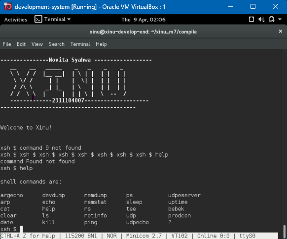
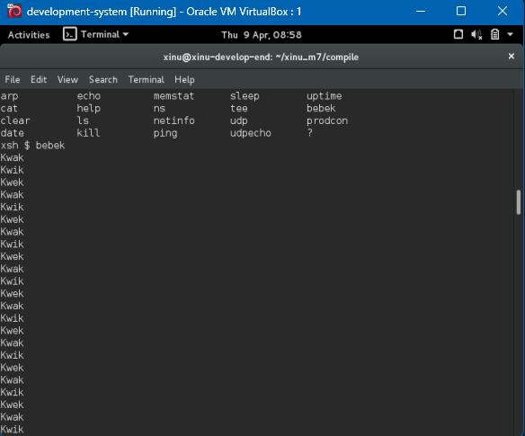
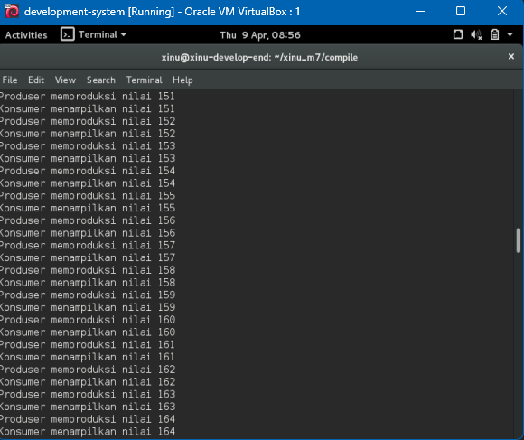

# <h1 align="center">Laporan Praktikum Modul 7<br> Semaphore </h1>
<p align="center">Novita Syahwa Tri Hapsari - 2311104007</p>

## Guided
# Dasar Teori Modul 7: Semaphore

## Pengertian Semaphore
Semaphore adalah mekanisme sinkronisasi dalam sistem operasi yang digunakan untuk mengatur akses beberapa proses terhadap resource bersama (shared resource). Dengan semaphore, sistem dapat menghindari konflik seperti race condition dan memastikan proses berjalan secara terkontrol.
Semaphore direpresentasikan sebagai variabel integer yang hanya dapat diakses melalui operasi khusus.

## Operasi Dasar Semaphore

### 1. Inisiasi (Initialization)
Semaphore harus diinisialisasi sebelum digunakan.

- Fungsi: menentukan jumlah resource yang tersedia
- Sintaks:
```
sid32 s;
s = semcreate(n);
```
### 2. Wait (P / Down)
Operasi wait digunakan untuk mengurangi nilai semaphore.

Jika nilai semaphore > 0 → proses lanjut
Jika nilai semaphore ≤ 0 → proses akan diblokir (menunggu)
Sintaks:
```
wait(s);
```
### 3. Signal (V / Up)
Operasi signal digunakan untuk menambah nilai semaphore.

Menandakan resource telah dilepas
Dapat membangunkan proses lain yang sedang menunggu
Sintaks:
```
signal(s);
```
## Pola Penggunaan Semaphore

1. Signaling
Digunakan untuk mengatur urutan eksekusi antar proses.
Tujuan
Memastikan proses P1 dijalankan terlebih dahulu sebelum P2.
```
s1 = semcreate(1);
s2 = semcreate(0);
```
Pola 
```
// Proses P1
wait(s1);
// proses P1
signal(s2);

// Proses P2
wait(s2);
// proses P2
signal(s1);
```
2. Mutex (Mutual Exclusion)
Digunakan untuk memastikan hanya satu proses yang dapat mengakses critical section pada satu waktu.
Tujuan
Mencegah konflik akses data pada resource bersama.
Inisiasi
```
mutex = semcreate(1);
```
pola
```
wait(mutex);
// critical section
signal(mutex);
```
Hasil Praktikum 
 

 

## Unguided
1. [50 poin] Buatlah 3 buah proses yaitu P1, P2 dan P3. P1 selalu menampilkan “kwak”, P2 selalu menampilkan “kwik”, P3 selalu menampilkan “kwek”. Menggunakan 3 proses tersebut dan beberapa buah semaphore, buatlah program yang dapat menampilkan: 
Kwak
Kwik
Kwek
Kwak
Kwik
Kwek
jawaban:
 

2. [50 poin] Buatlah proses bernama produser yang memproduksi bilangan 1-1000. Buatlah proses bernama konsumer yang akan menampilkan nilai yang diproduksi oleh produser. Gunakan semaphore! 
Produser memproduksi nilai 1
Konsumer menampilkan nilai 1
Produser memproduksi nilai 2
Konsumer menampilkan nilai 2
….
Produser memproduksi nilai 1000
Konsumer menampilkan nilai 1000
 

