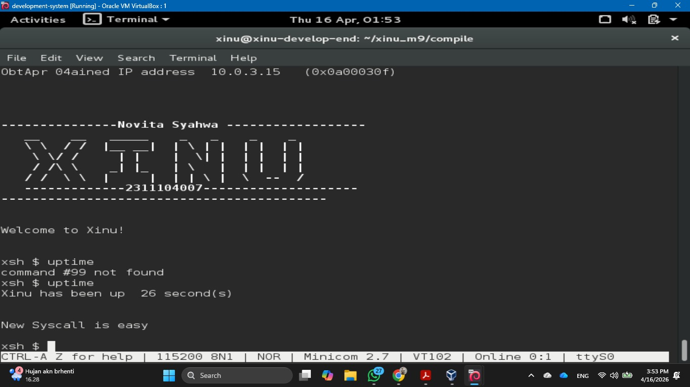
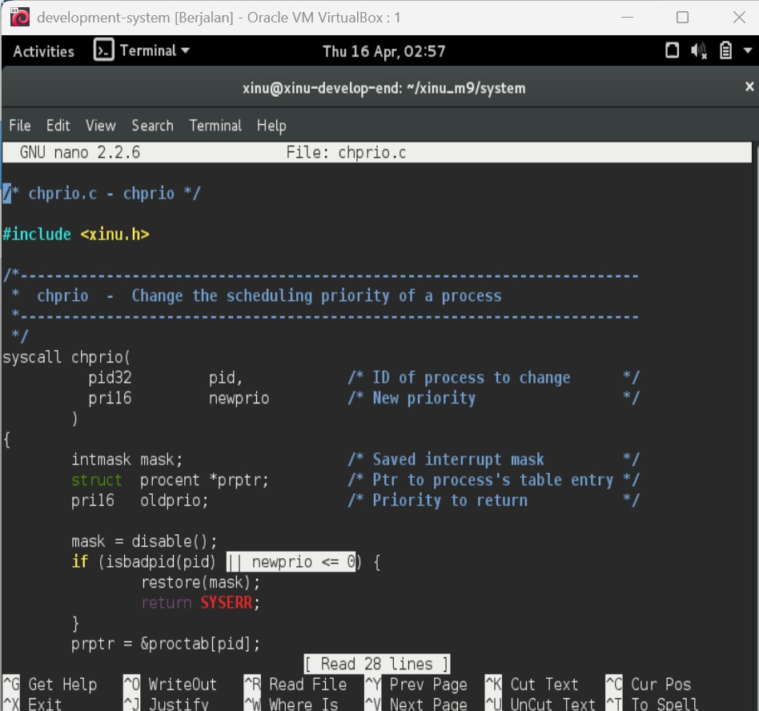
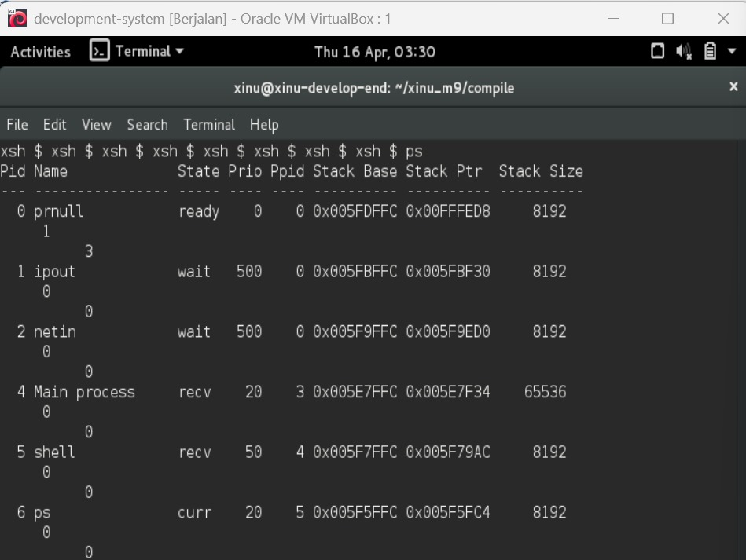
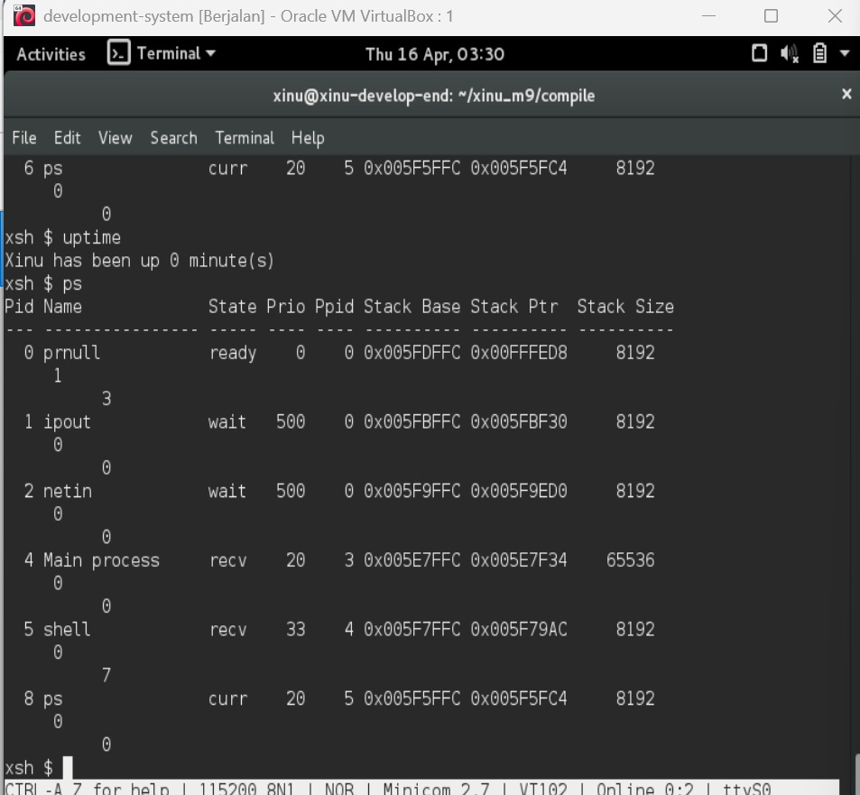
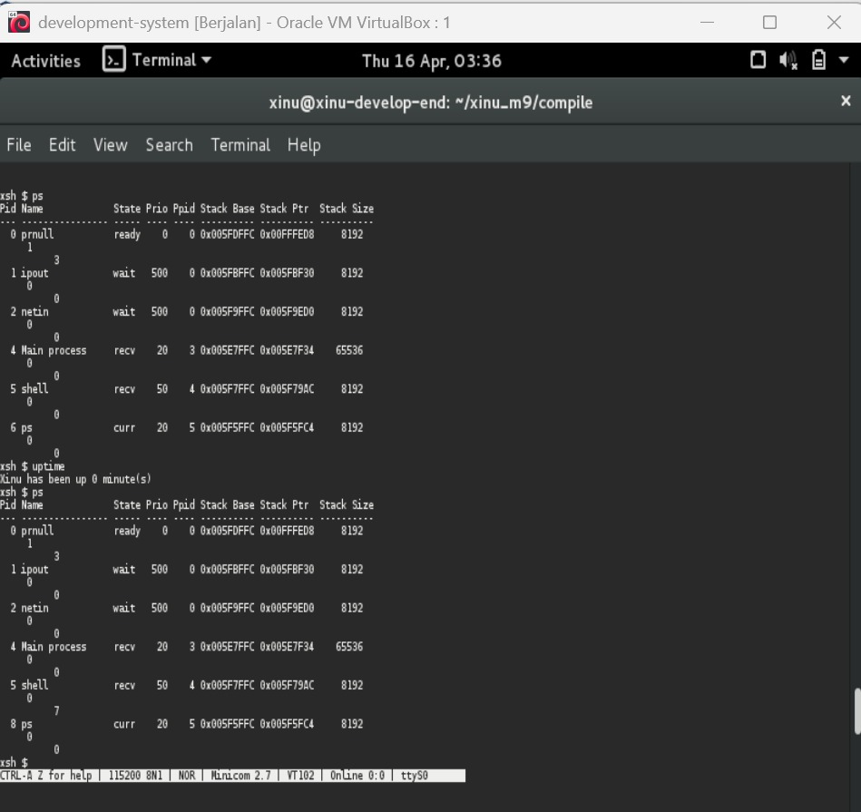
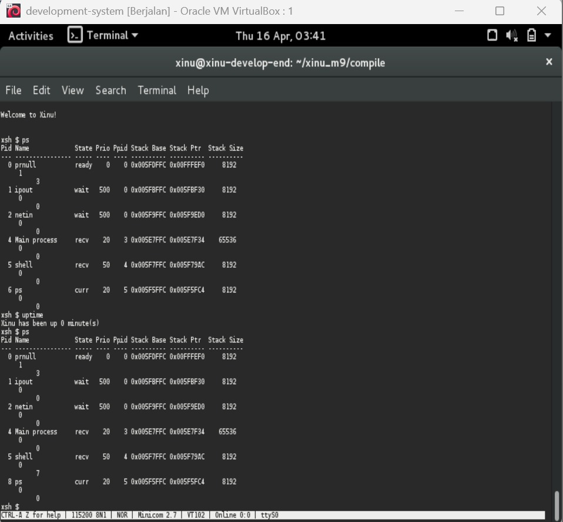

# <h1 align="center">Laporan Praktikum Modul 9<br> Syscall Xinu </h1>
<p align="center">Novita Syahwa Tri Hapsari - 2311104007</p>

## Dasar Teori

### System Call (Syscall)

System Call (syscall) adalah mekanisme atau antarmuka yang disediakan oleh sistem operasi agar proses atau program dapat berinteraksi dengan kernel untuk meminta berbagai layanan, seperti pengelolaan memori, file, dan operasi input/output. Melalui syscall, proses tidak perlu mengetahui detail implementasi internal sistem operasi, karena semua permintaan akan ditangani langsung oleh kernel. Selain itu, syscall juga berfungsi sebagai lapisan keamanan yang membatasi akses langsung ke sumber daya sistem, sekaligus menerapkan prinsip *information hiding* agar kompleksitas sistem tetap tersembunyi dari pengguna.

Dalam cara kerjanya, ketika sebuah proses memanggil syscall, sistem operasi akan terlebih dahulu menonaktifkan interupsi untuk menjaga konsistensi selama proses berlangsung. Setelah itu, argumen atau parameter yang diberikan oleh proses akan diperiksa untuk memastikan validitas dan keamanannya. Jika sudah valid, kernel akan menjalankan layanan sesuai dengan permintaan, misalnya membebaskan memori melalui fungsi seperti `freemem()`. Setelah proses eksekusi selesai, interupsi akan diaktifkan kembali agar sistem dapat melanjutkan tugas lainnya. Terakhir, hasil dari eksekusi tersebut, baik berhasil maupun gagal, akan dikembalikan kepada proses yang memanggil syscall.

## Guided

Langkah - langkah : 
1. Jalankan *development system* yang sudah terpasang di VirtualBox.  
2. Buka terminal, lalu gunakan perintah `ls` untuk melihat isi direktori.  
3. Unduh script modul dengan menjalankan `wget agha.work/modul9.sh`.  
4. Periksa isi file yang telah diunduh menggunakan perintah `cat modul9.sh`.  
5. Berikan izin eksekusi pada file tersebut dengan `chmod +x modul9.sh`.  
6. Jalankan script menggunakan perintah `./modul9.sh`.  
7. Masuk ke direktori kompilasi dengan `cd xinu_m9/compile/`, kemudian jalankan `make clean` dan dilanjutkan dengan `make` untuk melakukan proses build.  
8. Jalankan Xinu menggunakan perintah `sudo minicom`.  
9. Gunakan perintah `help` untuk memastikan syscall baru sudah tersedia.  
10. Lakukan pengujian dengan menjalankan perintah `uptime`. 
Setelah script selesai dijalankan, masuk ke direktori kompilasi dengan perintah `cd xinu_m9/compile/`. Lakukan proses build ulang dengan menjalankan `make clean`, kemudian lanjutkan dengan `make` untuk mengompilasi project.

## Unguided
### 1. Buat syscall baru seperti yang ditunjukkan pada modul syscall poin 9.5! (sertakan Screenshot kode dan hasil run)  
Jawaban:

 

### 2. Perbaiki syscall chprio (xinu/system/chprio.c) dengan memperhatikan validasi input
Sebelum menjalankan atau menguji program, pastikan beberapa hal berikut:
- Nilai **ID proses** berada dalam rentang `0` hingga `NPROC` (jumlah maksimum proses yang diperbolehkan).  
- Nilai **prioritas** harus berupa bilangan positif (lebih dari 0).
- Jalankan perintah `make clean` untuk membersihkan hasil kompilasi sebelumnya.
- Jalankan perintah `make` untuk melakukan kompilasi ulang program.   
Jawab:
 

Setelah penambahan validasi pada PID dan nilai prioritas di syscall **chprio**, sistem menjadi lebih aman dalam menangani input. Proses kompilasi ulang berjalan tanpa error, menandakan perubahan berhasil diterapkan. Saat menggunakan input valid, perubahan prioritas proses berjalan normal. Sebaliknya, input tidak valid (PID di luar batas atau prioritas negatif) tidak menyebabkan crash dan tidak mengubah prioritas. Ini menunjukkan bahwa validasi berfungsi efektif dalam mencegah kesalahan input.

### 3. Lakukan hal hal berikut ini 
- Edit xsh_uptime.c 
File yang diedit:
`xsh_uptime.c`

Tambahkan validasi argumen dan pemanggilan syscall berikut:

```c
/* Validasi jumlah argumen */
if (nargs > 1) {
    fprintf(stderr, "%s: too many arguments\n", args[0]);
    fprintf(stderr, "Try %s --help for more information\n", args[0]);
    return 1;
}

/* Pemanggilan syscall */
chprio(5, 33); // Mengubah prioritas proses ID 5 menjadi 33
```
- Compile source code tersebut dengan perintah (make clean, make)
- Jalankan perintah ps (xsh $ ps, perhatikan prioritas proses dengan id = 5)
- Jalankan uptime (xsh $ uptime, Perhatikan hasil perintah tersebut)
- Jalankan ps (xsh $ ps, perhatikan prioritas proses dengan id = 5 seharusnya sudah berubah)

Testing chprio syscall yang telah diubah

a. Testing prioritas tidak boleh < 0: Ubah “chprio(5,33) menjadi “chprio(5,-3)” pada xsh_uptime.c

b. Testing id adalah valid: Ubah “chprio(5,33)” menjadi “chprio(3000,3)”

c. Hasil dua testing di atas adalah prioritas tidak berubah karena salah argument (dibuktikan dengan menggunakan perintah ps)

Jawab :  

a. 

 

b.  

c.  

## D. Referensi

1. https://telkomuniversityofficial-my.sharepoint.com/shared?listurl=https%3A%2F%2Ftelkomuniversityofficial-my.sharepoint.com%2Fpersonal%2Fmaghaz_student_telkomuniversity_ac_id%2FDocuments&id=%2Fpersonal%2Fmaghaz_student_telkomuniversity_ac_id%2FDocuments%2F2026%2F00.+Modul+Praktikum+Sistem+Operasi+SE+2526-2.pdf&parent=%2Fpersonal%2Fmaghaz_student_telkomuniversity_ac_id%2FDocuments%2F2026&shareLink=1&ga=1
2. https://medium.com/@krisnawahyudipratama/memahami-syscall-konsep-mekanisme-dan-implementasi-di-xinu-7d1cdf7a2b7f
