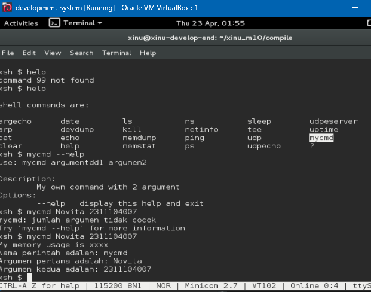
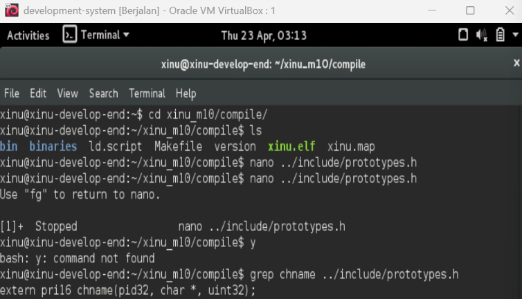
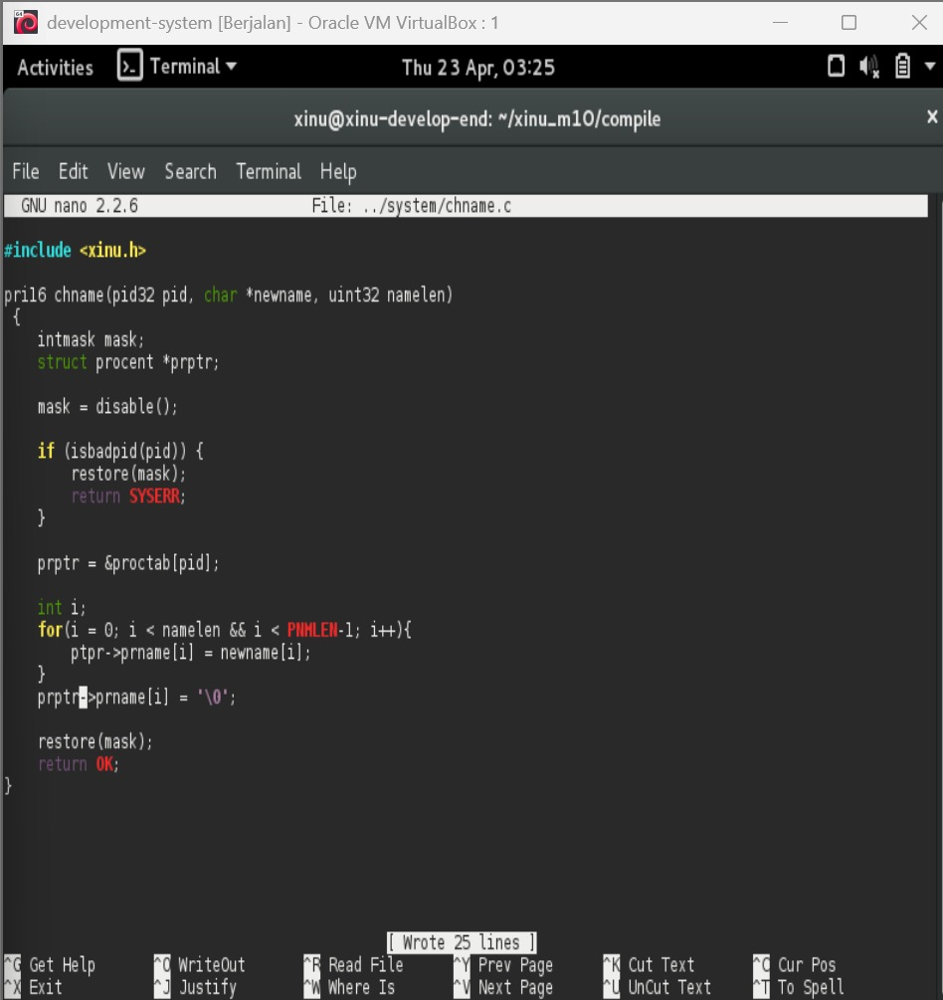
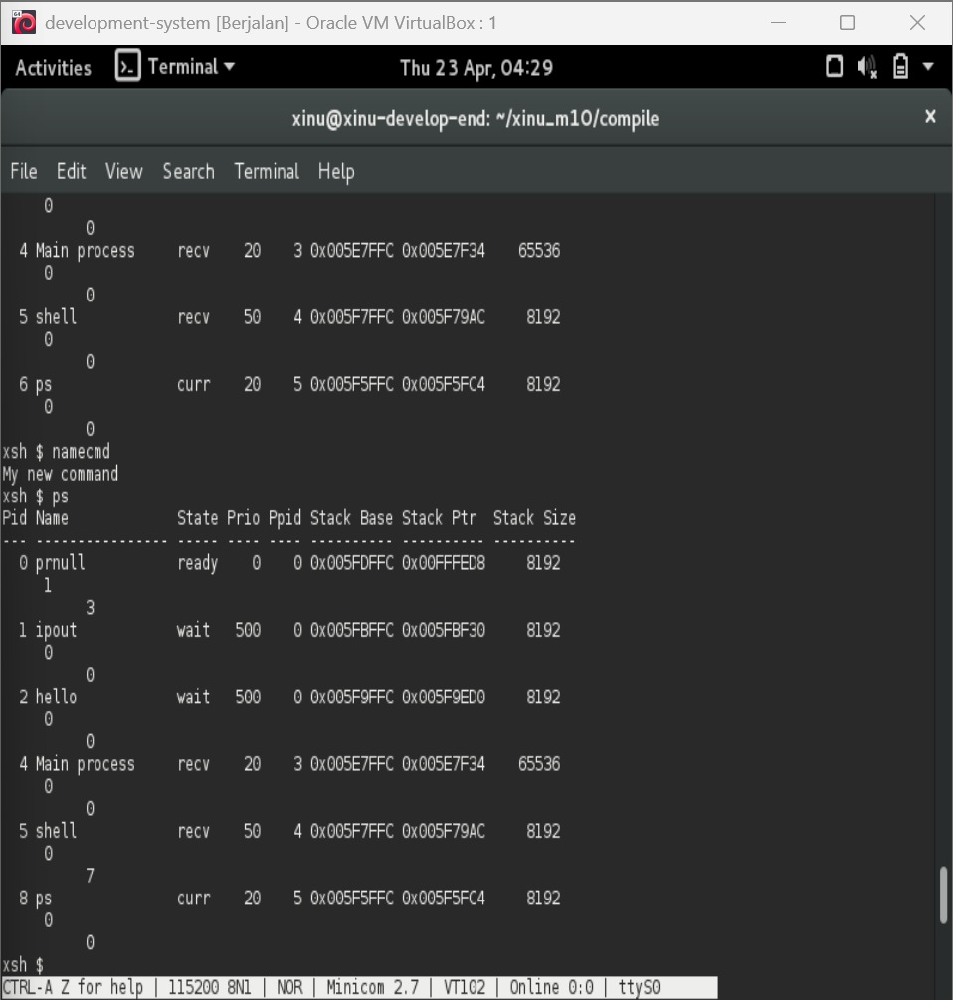

# <h1 align="center">Laporan Praktikum Modul 10<br> Shell </h1>
<p align="center">Novita Syahwa Tri Hapsari - 2311104007</p>

## Dasar Teori
Shell merupakan penghubung antara manusia dan sistem operasi. Ia menerjemahkan instruksi yang kita ketik menjadi sesuatu yang bisa dimengerti oleh komputer. Shell adalah program yang memproses perintah yang diberikan oleh user pada terminal. Shell akan looping secara terus menerus membaca baris input yang diberikan. Setelah sebuah baris input dibaca ditandai dengan adanya ENTER, shell harus mengekstrak nama perintah, argumen dan hal-hal lainnya. Jika proses ektraksi berhasil maka perintah akan dieksekusi sesuai dengan argumen yang diberikan.
Contoh perintah pada shell:
ls -al
nama_perintah = “ls”
argument 1 = “-al”

## Guided
Langkah - langkah : 
1. Running Development-system yang di VirtualBox
2. Ketik ls pada terminal
3. Download script modul : wget agha.work/modul10.sh 
4. Beri permission : chmod +x modul10.sh
5. Jalankan script ./modul10.sh
6. Compile project dengan cd xinu_m10/compile/ lalu make clean setelah itu make
7. Jalankan Xinu dengan sudo minicom
8. Cek syscall baru dengan ketik help
8. Jalankan syscall dengan ketik mycmd

 

## Unguided
### 1. [40 Poin] Akan dimodifikasi shell dengan modifikasi syscall bernama chname yang berfungsi untuk mengubah nama suatu proses. Lihat kembali modul sebelumnya cara membuat syscall.
Perhatikan sekarang syscall chname mempunyai 3 parameter yaitu pid, character dan  panjang character. Character untuk menyimpan nama dan panjang character untuk panjang nama.

a. Pada prototypes.h chname diubah menjadi:
```
/* in file chname.c */
extern pri16 chname(pid32, char *, uint32);
```
b. Pada chname.c fungsi diubah dari: 

sebelum:
```
pri16 chname(
    pid32 pid,        /* ID of process to change */
    pri16 newprio     /* New priority */
)
```
sesudah:
```
pri16 chname(
    pid32 pid,        /* ID of process to change */
    char *newname,    /* New process name */
    uint32 namelen    /* Length of name */
)
```
jawaban a:

 

jawaban b :

 

### 2. Buatlah perintah baru bernama namecmd sesuai dengan langkah-langkah pada no.5 pada modul shell!
Berikut adalah kode dalam perintah baru namecmd:
```
printf("My new command");

// pid 3 = netin; mengubah nama proses pid 3 dari "netin" menjadi "hello"
chname(3, "hello", 5);

return 0;
```
Jawab:

 

### 3. [20 Poin] Test hasilnya:
a. Masuk ke terminal xinu
b. Jalankan perintah ps
c. Jalankan perintah namecmd
d. Jalankan perintah ps
e. Lihat nama proses telah berubah
Jawaban:
Pengujian dimulai dengan menjalankan perintah **ps** untuk menampilkan proses-proses yang sedang berjalan. Setelah itu, perintah **namecmd** dijalankan untuk melakukan perubahan nama proses dengan memanfaatkan syscall **chname**. Selanjutnya, perintah **ps** dijalankan kembali guna melihat apakah perubahan telah berhasil. Hasil yang diperoleh menunjukkan bahwa nama proses yang semula **netin** telah berubah menjadi **hello**, sehingga dapat disimpulkan bahwa perintah **namecmd** dan syscall **chname** bekerja dengan baik sesuai fungsinya.

 
