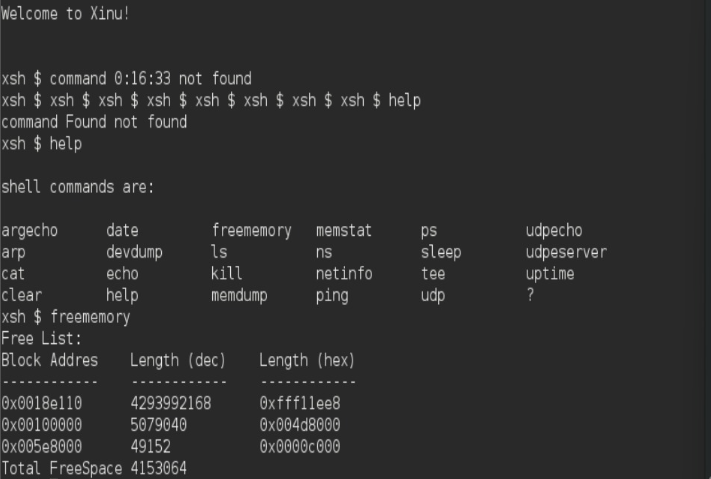

# <h1 align="center">Laporan Praktikum Modul 11  Memori Xinu </h1>

Novita Syahwa Tri Hapsari - 2311104007

## Dasar Teori 
Manajemen memori yang efisien merupakan salah satu komponen penting dalam sistem operasi. Xinu sebagai sistem operasi minimalis menerapkan mekanisme pengelolaan memori yang dirancang secara efektif untuk menangani alokasi memori statis maupun dinamis. Pada materi ini akan dipelajari mengenai struktur serta cara kerja manajemen memori pada Xinu.

## Unguided
### 1. Buatlah perintah baru bernama freememory yang memiliki dua fungsi berikut:
a. Menampilkan seluruh free memory block yang tercatat dalam free memory
list pada Xinu.

 

Langkah-langkah:
1. Running Development-system yang ada di VirtualBox.
2. Ketik ls pada terminal.
3. Buat folder project Modul 11 dengan perintah cp -r xinu xinu_m11.
4. Masuk ke project dengan cd xinu_m11.
5. Buat file command baru bernama xsh_freememory.c di folder shell:nano shell/xsh_freememory.c
6. Ketik source code yang digunakan untuk menampilkan daftar memori kosong/free memory yang masih tersedia di sistem Xinu.
7. Simpan file dengan CTRL + O → Enter -> CTRL + X
8. Edit prototype dulu : nano include/shprototypes.h 
9. Cari xsh_help lalu tambahkan : extern shellcmd xsh_freememory(int32, char *[]);
10. Simpan file dengan CTRL + O → Enter -> CTRL + X
11. Edit daftar command di shell.c, ketik : nano shell/shell.c
12. Cari bagian help lalu tambahkan : {"freememory", xsh_freememory},
13. Simpan file dengan CTRL + O → Enter -> CTRL + X
14. Compile project dengan cd compile, lalu make clean setelah itu make.
15. Jalankan Xinu dengan sudo minicom.
16. Cek command baru dengan mengetik help.
17. Jalankan command dengan mengetik freememory.

### 2.  Jawablah pertanyaan berikut:
a. Mengapa Xinu memisahkan data segment dan BSS segment?
b. Bagaimana alokasi dan dealokasi memori selama eksekusi memengaruhi ukuran free space?
c. Mengapa penggunaan heap lebih berpotensi menimbulkan masalah dibandingkan stack?
d. Mengapa Xinu menggunakan struktur linked list untuk menyimpan free block?
e. Apa tantangan utama dalam penggunaan heap di Xinu?
 
Jawab :  
a. Xinu memisahkan data segment dan BSS segment agar pengelolaan memori lebih rapi dan efisien. Data segment digunakan untuk menyimpan variabel global atau static yang sudah memiliki nilai awal, sedangkan BSS segment digunakan untuk variabel global atau static yang belum diberi nilai awal atau bernilai nol. Dengan pemisahan ini, sistem tidak perlu menyimpan semua nilai nol ke dalam file program, sehingga ukuran program menjadi lebih kecil dan proses inisialisasi memori lebih mudah.

b. Saat terjadi alokasi memori, sebagian ruang kosong akan digunakan oleh proses, sehingga ukuran free space berkurang. Sebaliknya, saat terjadi dealokasi memori, memori yang sudah tidak dipakai akan dikembalikan ke daftar memori kosong sehingga free space bertambah. Namun, jika alokasi dan dealokasi dilakukan berulang dengan ukuran yang berbeda-beda, dapat terjadi fragmentasi, yaitu memori kosong terpecah menjadi beberapa bagian kecil.

c. Heap lebih berpotensi menimbulkan masalah karena penggunaannya bersifat dinamis dan harus dikelola dengan hati-hati. Jika memori yang sudah dipakai tidak dikembalikan, maka dapat terjadi memory leak. Selain itu, heap juga dapat mengalami fragmentasi, kesalahan pointer, atau penggunaan memori yang sudah dibebaskan. Berbeda dengan stack yang bekerja lebih teratur karena mengikuti urutan pemanggilan fungsi dan otomatis dilepas setelah fungsi selesai.

d. Xinu menggunakan struktur linked list karena free block memiliki ukuran dan alamat yang berbeda-beda. Dengan linked list, setiap blok memori kosong dapat dihubungkan menggunakan pointer tanpa harus berada pada lokasi yang berurutan. Struktur ini memudahkan Xinu dalam menambah, menghapus, mencari, dan menggabungkan blok memori kosong saat proses alokasi atau dealokasi dilakukan.

e. Tantangan utama penggunaan heap di Xinu adalah menjaga agar memori tetap efisien dan tidak mengalami kerusakan selama proses alokasi dan dealokasi. Masalah yang dapat terjadi antara lain fragmentasi memori, memory leak, pointer yang salah, serta kesulitan menggabungkan kembali blok memori kosong. Jika heap tidak dikelola dengan baik, sistem dapat kekurangan memori meskipun sebenarnya masih ada ruang kosong yang tersebar.

