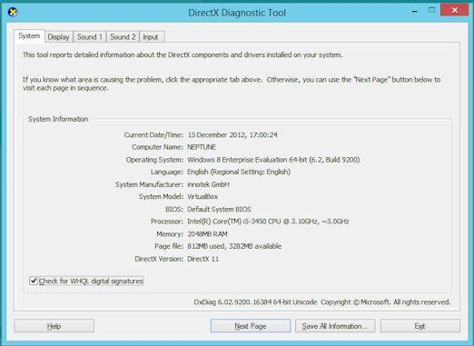
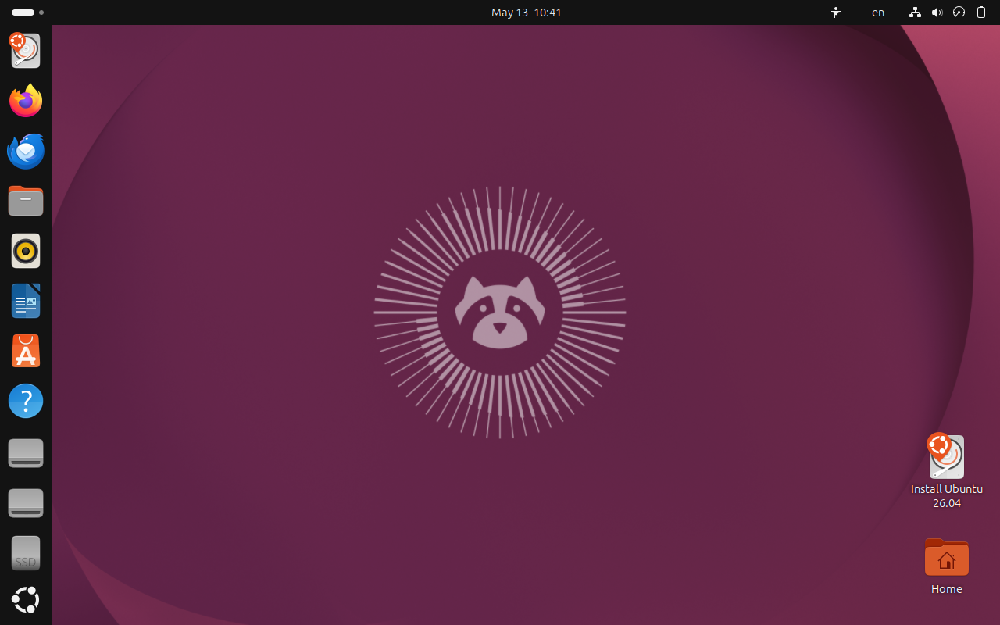

# <h1 align="center">Laporan Praktikum Modul 12  Linux dan Windwos </h1>

Novita Syahwa Tri Hapsari - 2311104007

## Dasar Teori

Sistem operasi merupakan perangkat lunak yang berfungsi untuk mengatur dan mengoordinasikan seluruh aktivitas serta sumber daya pada komputer sehingga aplikasi dapat berjalan dengan baik. Dua sistem operasi yang banyak digunakan adalah Linux dan Windows. Linux merupakan sistem operasi open source yang dikembangkan berdasarkan kernel Linux dan dikenal memiliki tingkat stabilitas, keamanan, serta fleksibilitas yang tinggi. Linux banyak digunakan dalam pengembangan perangkat lunak, server, maupun sistem embedded karena mendukung multitasking dan multiuser dengan baik. Salah satu distribusi Linux yang populer adalah Ubuntu yang mudah digunakan dan memiliki dukungan komunitas yang luas. Sementara itu, Windows adalah sistem operasi yang dikembangkan oleh Microsoft dengan antarmuka berbasis grafis atau Graphical User Interface (GUI) yang memudahkan pengguna dalam mengoperasikan komputer. Windows berkembang dari sistem berbasis command line menjadi sistem operasi modern yang mendukung berbagai aplikasi, multimedia, jaringan, dan perangkat keras terbaru. Kedua sistem operasi tersebut memiliki kelebihan masing-masing dan banyak digunakan dalam kebutuhan komputasi sehari-hari maupun proses pembelajaran praktikum sistem operasi.

## Unguided 
## 1. [10 Poin] Jelaskan dengan bahasa sendiri, apa itu Sistem Operasi?

Jawaban:

Sistem operasi adalah perangkat lunak utama yang mengatur dan mengelola seluruh aktivitas pada komputer atau perangkat elektronik. Sistem operasi menjadi penghubung antara pengguna dengan perangkat keras (*hardware*) seperti keyboard, mouse, memori, dan penyimpanan.

Tanpa sistem operasi, komputer tidak bisa digunakan dengan mudah karena semua perangkat dan aplikasi tidak dapat berjalan sendiri. Sistem operasi bertugas mengatur proses kerja komputer, menjalankan aplikasi, mengelola file, mengatur penggunaan memori, serta memastikan perangkat keras dapat bekerja dengan baik.

Contoh sistem operasi yang sering digunakan antara lain:
 - Windows
 - Linux
 - macOS
 - Android
 - iOS

## 2. [25 Poin] Buka dxdiag pada kolom search windows, dan jawab pertanyaan berikut!
[5 Poin] Sertakan Screenshot!

 

### a. Windows apakah yang diinstal?
Windows yang diinstal adalah **Windows 8**.

### b. Berapa bit Windows yang diinstall?
Windows yang digunakan adalah **64-bit**.

### c. Berapa kecepatan processor yang digunakan?
Processor yang digunakan memiliki kecepatan sekitar **3.10 GHz**.

### d. Grafik yang digunakan versi berapa? Apakah sudah sesuai dengan spesifikasi rekomendasi pada modul?
Grafik yang digunakan sudah mendukung **DirectX 11** sehingga sudah sesuai dengan spesifikasi rekomendasi pada modul.

## 3. [10 Poin] Apa kelebihan dari windows yang terpasang sekarang? Sebutkan versi berapa windows terbaru saat ini!

### Kelebihan Windows 8
- Tampilan lebih modern dengan antarmuka tile.
- Proses booting lebih cepat dibanding Windows 7.
- Mendukung aplikasi dan hardware yang lebih baru.
- Memiliki performa yang cukup ringan.
- Sudah mendukung sistem 64-bit dengan baik.

### Versi Windows Terbaru Saat Ini
Versi Windows terbaru saat ini adalah Windows 11.

## 4. [25 Poin] Buka virtualbox, dan jawab pertanyaan berikut!
[5 Poin] Sertakan Screenshot!

 

a. [5 Poin] Linux apakah yang diinstall?
 
jawaban:Linux yang diinstall pada gambar adalah Ubuntu Linux

b. [5 Poin] Berapa bit Linux yang diinstall?
jawaban: ubuntu 64bit
c. [5 Poin] Berapa ukuran hard disk virtual mesin?

d. [5 Poin] Terdapat berapa buah partisi pada hard disk?

## 5. [10 Poin] Linux memiliki berbagai jenis, sebutkan 5 jenis linux distro!
   
jawaban:

Berikut adalah 5 jenis distro Linux yang sering digunakan yaitu
- Ubuntu  
  Distro Linux yang populer dan mudah digunakan, cocok untuk pemula.
- Debian  
  Distro yang terkenal stabil dan menjadi dasar bagi banyak distro lain.
- Fedora  
  Distro yang menggunakan teknologi terbaru dan dikembangkan dengan dukungan dari Red Hat.
- Arch Linux  
  Distro yang ringan dan fleksibel, biasanya digunakan oleh pengguna yang sudah berpengalaman.
- Linux Mint  
  Distro dengan tampilan sederhana dan nyaman digunakan untuk kebutuhan sehari-hari.
  
## 6. [10 Poin] Anda sudah mengenal dan menggunakan 3 jenis sistem operasi pada
praktikum ini, sebutkan sistem operasi tersebut!

jawaban : Pada praktikum ini, terdapat 3 jenis sistem operasi yang digunakan, yaitu:
- Windows
- Linux
- macOS
## 7. [10 Poin] Setelah mengenal 3 jenis sistem operasi tersebut, menurut Anda sistem operasi mana yang lebih mudah digunakan? Jelaskan argumentasi Anda!

jawaban:

Menurut saya, sistem operasi yang paling mudah digunakan adalah Windows. Hal ini karena tampilan antarmukanya sederhana dan mudah dipahami, terutama bagi pengguna pemula. Selain itu, Windows juga memiliki banyak dukungan aplikasi dan driver sehingga lebih mudah digunakan untuk berbagai kebutuhan, seperti belajar, maupun bekerja.

Windows juga lebih familiar digunakan di sekolah, kampus, dan tempat kerja sehingga pengguna tidak memerlukan banyak penyesuaian saat menggunakannya.
