<h1 align="center">Laporan Praktikum Modul 13    Perintah Dasar Linux </h1>

Novita Syahwa Tri Hapsari - 2311104007

## A. Dasar Teori

### a. Perintah Dasar
Secara umum, perintah pada Linux dijalankan melalui Bash Shell (/bin/bash). Bash berfungsi sebagai antarmuka yang menerima perintah dari pengguna dan meneruskannya ke sistem untuk dieksekusi.

### b. Aturan Dasar Penulisan Perintah
Linux bersifat case sensitive, sehingga perbedaan huruf besar dan kecil akan memengaruhi hasil eksekusi perintah. Format umum penulisan perintah Linux adalah:
    $ perintah [opsi] [parameter]
Keterangan:
- Perintah: Instruksi atau program yang dijalankan.
- Opsi: Digunakan untuk memodifikasi perilaku perintah (biasanya diawali dengan - atau --)
- Parameter: Objek yang dikenai perintah, seperti file atau direktori.

## B. Unguided

### I. Perintah-Perintah Dasar Linux

#### 1. Pada terminal Linux terdapat command prompt seperti ini: ubuntu@localhost:~$

a. Jalankan dan screenshot terminal Anda!
  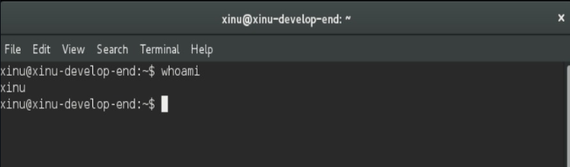 

b. Jelaskan arti dari command prompt milik Anda!

   Xinu adalah nama pengguna aktif, dan xinu-develop-end adalah nama host atau komputer yang digunakan. Direktori home user dapat dilihat dengan tanda "~" dan pengguna yang aktif ditunjukkan sebagai user biasa (bukan root).
   
#### 2. Setiap perintah pada Linux mempunyai bentuk umum: nama_perintah option command_line_argument

a. Jalankan dan screenshot perintah berikut ini: ls
   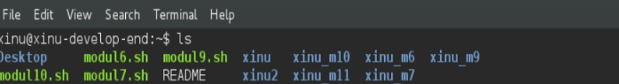 

b. Apakah option dan parameter dari perintah di atas?
   - Nama perintah = ls
   - Option = tidak ada
   - Parameter = tidak ada

c. Apa fungsi dari perintah tersebut?

   Perintah ls digunakan untuk menampilkan daftar file dan folder pada direktori saat ini.

 d. Jalankan perintah berikut ini: ls -al /

   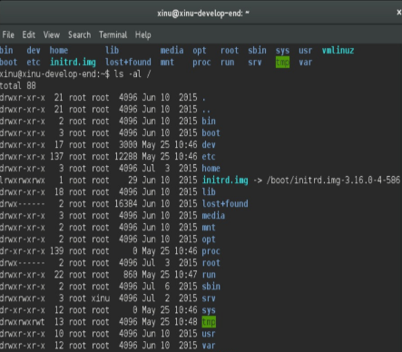 

e. Apakah option dan parameter dari perintah di atas?

   - Nama perintah = ls
   - Option = -al
   - Parameter = /

f. Apa fungsi dari perintah tersebut?

   - Option -a digunakan untuk menampilkan file tersembunyi.
   - Option -l digunakan untuk menampilkan detail file dan folder.
   - Parameter / menunjukkan direktori root Linux.

g. Jelaskan mengapa perintah pada a dan e mempunyai hasil yang berbeda!

   Hasil berbeda karena ls hanya menampilkan isi direktori yang sedang aktif saat ini, sedangkan ls -al / menampilkan isi direktori root (/) secara detail termasuk file tersembunyi. 

#### 3. Melihat struktur direktori dan file pada Linux sama seperti melihat file dan direktori(folder) yang berada pada GUI. Pada Linux terdapat direktori utama yaitu “/” (root). Dibawah direktori root terdapat berbagai direktori yang lain seperti: home, etc, usr, dll. Contoh: program firefox terdapat pada path /usr/lib/firefox, berarti untuk mengakses firefox kita berjalan dari root kemudian direktori “usr” dilanjutkan direktori “lib” baru dapat mengeksekusi firefox

a. Jalankan dan tunjukan perintah: pwd

   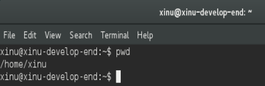 
   
 Apakah option dan parameter dari perintah tersebut?

   - Nama perintah = pwd
   - Option = tidak ada
   - Parameter = tidak ada

c. Apa fungsi perintah tersebut?

   Perintah pwd (Print Working Directory) digunakan untuk menampilkan lokasi atau direktori kerja saat ini.

   ### 4. Perpindahan

a. Jalankan dan screenshot perintah: cd /

   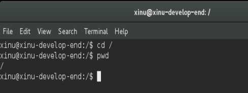 

b. Apakah option dan parameter dari perintah tersebut?

   - Nama perintah = cd
   - Option = tidak ada
   - Parameter = /

c. Apa yang dilakukan perintah tersebut?

   Perintah cd / digunakan untuk berpindah ke direktori root (/) pada sistem Linux.

   #### 5. Direktori khusus

a. Lakukan dan screenshot perintah cd / kemudian lakukan perintah cd ~. Jelaskan hasil dari keduanya!

   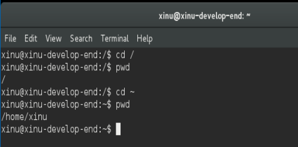 
   
   Perintah cd / memindahkan pengguna ke direktori root (/). Sedangkan cd ~ memindahkan pengguna ke direktori home user (/home/xinu). Perbedaannya adalah cd / menuju direktori utama sistem, sedangkan cd ~ menuju direktori milik pengguna yang sedang aktif.

   b. Lakukan perintah cd /proc/self. Buatlah perintah menggunakan cd .. agar dapat berpindah ke direktori / (root). Berapa kali perintah cd .. harus dieksekusi? Screenshot hasilnya!

   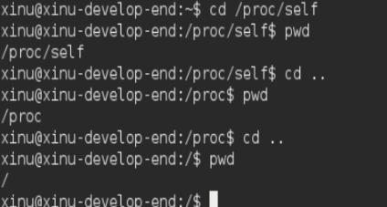 

   Perintah cd .. harus dieksekusi 2 kali untuk berpindah dari /proc/self ke direktori root (/).

   #### 6. Copy, rename dan delete file (screenshot setiap tahapan!)

a. Copylah file dari /proc/cpuinfo ke folder home Anda (/home/user/) menggunakan command pada terminal. Ganti user dengan username anda.

   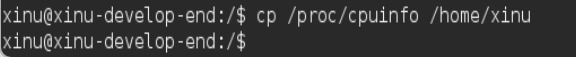 

b. Tunjukkan menggunakan perintah bahwa file tersebut benar-benar telah dicopy ke folder home Anda.

   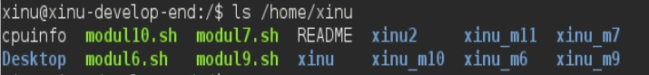 

c. Copy file dari /proc/uptime ke folder home Anda.

   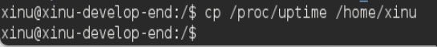 

d. Tunjukkan menggunakan perintah bahwa file tersebut benar-benar telah dicopy ke folder home Anda.

   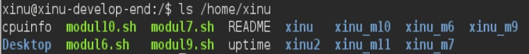 

e. Hapuslah file uptime di folder home Anda.

   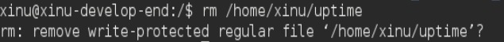 

f. Tunjukkan menggunakan perintah bahwa file tersebut benar-benar telah dihapus ke folder home Anda.

   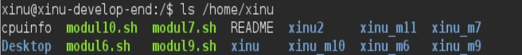 

g. Rename file cpuinfo di folder home Anda menjadi infocpu

   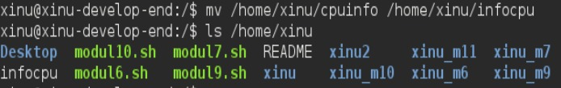 

   #### 7. Membuat folder baru.

a. Buatlah folder baru dengan nama “nim_anda”.

  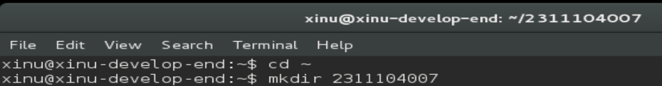
  
b. Buatlah di dalam folder “nim_anda”, folder baru dengan nama “nama_anda”.

  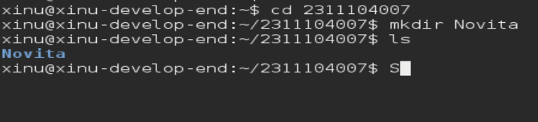 

  #### 8. Membaca manual

a. Bukalah fungsi manual untuk perintah “ls”

  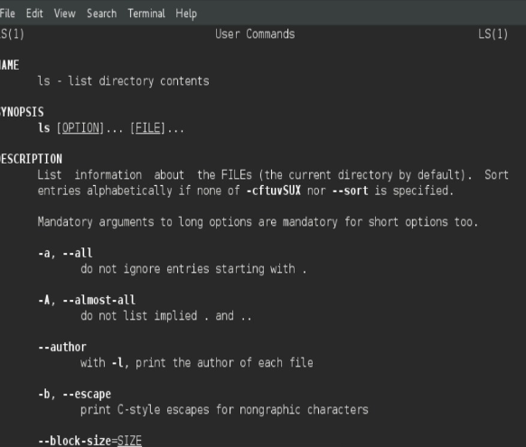 

b. Apa fungsi perintah “ls”?

   Perintah ls digunakan untuk menampilkan daftar file dan direktori.

c. Siapakah pencipta perintah “ls”?
   
writen by Torbjom Grandlund, David Mackenzie, and Jim Mereying.

d. Apakah arti dari -h dari manual ls?

   -h (human readable) digunakan untuk menampilkan ukuran file dalam format yang lebih mudah dibaca seperti KB, MB, GB.

e. Option apa yang harus digunakan agar dapat melihat direktori secara rekursif?

   -R digunakan untuk menampilkan isi direktori beserta subdirektori secara rekursif.

f. Bukalah fungsi manual untuk perintah “cp”

  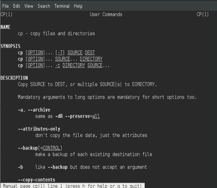 

g. Apa fungsi perintah “cp”

   cp digunakan untuk menyalin (copy) file atau direktori.

h. Siapakah pencipta perintah “cp”?

writen by Torbjom Grandlund, David Mackenzie, and Jim Mereying.

i. Apakah arti -v dalam perintah “cp?

   -v (verbose) digunakan untuk menampilkan proses penyalinan secara detail.

j. Jika ingin interaktif, option apa yang harus digunakan?

   -i (interactive) meminta konfirmasi sebelum file ditimpa.

   #### 9. Pipe

a. Lakukan perintah ini cat /etc/passwd dan screenshot hasil perintah tersebut!

  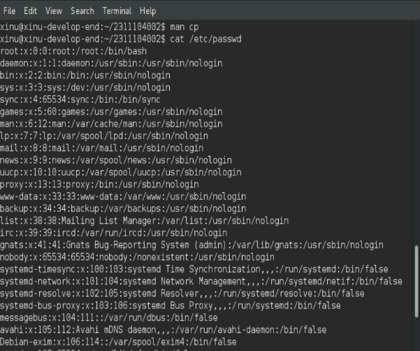 

b. Apa fungsi perintah cat?

   Perintah cat digunakan untuk menampilkan isi file ke terminal.
   
c. Lakukan perintah cat /etc/passwd | grep daemon dan screenshot hasil perintah tersebut!

  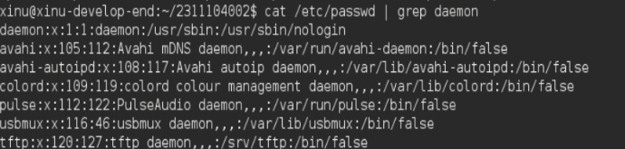 

d. Lakukan perintah cat /etc/passwd | grep root dan screenshot hasil perintah tersebut!

  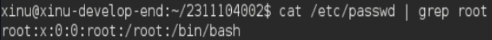 

e. Lakukan perintah cat /etc/passwd | grep nobody dan screenshot hasil perintah
tersebut!

  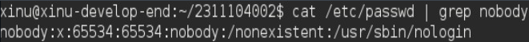 
   
f. Apakah fungsi perintah “ | grep daemon”?

   Tanda | (pipe) digunakan untuk mengirim output dari perintah sebelumnya ke perintah berikutnya, sedangkan grep daemon digunakan untuk mencari baris yang mengandung kata daemon.

### 10. Redirection

a. Lakukan perintah dan jelaskan hasilnya : cd / , ls -al > /home/user/result.txt , Ganti user dengan username ubuntu anda.

  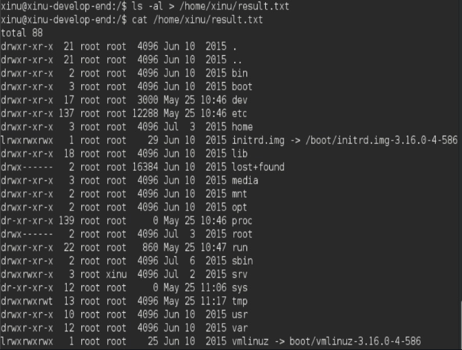 

   Perintah ls -al menampilkan isi direktori root (/) secara detail, lalu hasilnya disimpan ke file result.txt.

b. Dimana file result.txt berada?

   /home/xinu/result.txt

c. Lakukan perintah dan jelaskan hasilnya : cd /etc , ls -al > /home/user/result.txt , Ganti user dengan username ubuntu anda.

  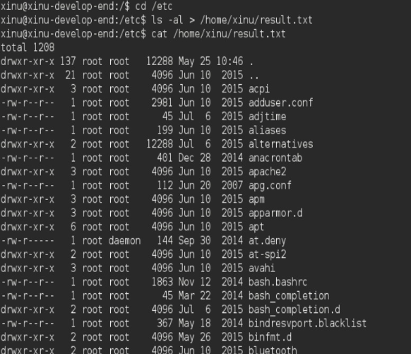 

   Isi result.txt berubah menjadi daftar file dari direktori /etc, karena tanda > menimpa isi file sebelumnya.

d. Apakah fungsi dari perintah >?

   > digunakan untuk mengarahkan output ke file dan mengganti isi file lama (overwrite).

e. Lakukan perintah dan jelaskan hasilnya : cd / , ls -al >> /home/user/result1.txt , Ganti user dengan username ubuntu anda.

  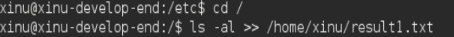 

   Hasil ls -al dari direktori / ditambahkan ke file result1.txt.

f. Lakukan perintah dan jelaskan hasilnya : cd /etc , ls -al >> /home/user/result1.txt , Ganti user dengan username ubuntu anda.

  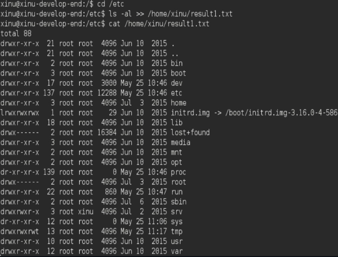 

   Hasil ls -al dari direktori /etc ditambahkan ke file result1.txt, tanpa menghapus isi sebelumnya.

g. Apakah perbedaan perintah > dan >>?

   > menimpa atau mengganti isi file lama (overwrite).
   >> menambahkan isi baru ke file tanpa menghapus isi lama (append).

### II. Kompile Source Code

#### 1. Buatlah file dengan nama 2_1.c yang berisi:

  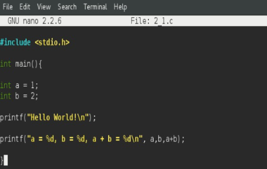 

#### 2. Kompile source code tersebut menggunakan gcc! Nama output program adalah 2_1 (bukan a.out). Tuliskan perintah untuk mengkompile source code tersebut!

  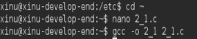 

#### 3. Jalankan program yang baru saja Anda kompile. Tuliskan perintah untuk menjalankan program tersebut!

  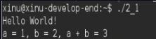 

#### 4. Buatlah file dengan nama 2_2.c yang berisi:

  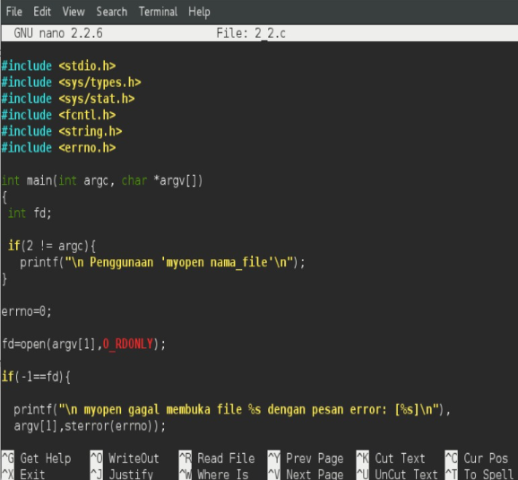 

#### 5. Kompile source code tersebut menggunakan gcc! Nama output program adalah “myopen”. Tulis perintah untuk mengkompile source code tersebut.

  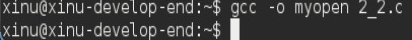 

#### 6. Jalankan program myopen yang baru saja Anda buat! Tuliskan perintah untuk menjalankan program myopen.

  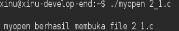 

#### 7. Jelaskan apa yang dilakukan program tersebut!
   Program myopen digunakan untuk mencoba membuka file yang diberikan sebagai parameter. Jika file berhasil dibuka maka akan menampilkan pesan bahwa file berhasil dibuka. Jika gagal, program menampilkan pesan error.
   
