# <h1 align="center">Laporan Praktikum Modul 14  <br> Scripting </h1>
<p align="center">NOVITA SYAHWA TRI HAPSARI- 2311104007</p>

## A. Dasar Teori

### a. Bash
Bash (Bourne-Again Shell) adalah sebuah jembatan antara kita sebagai user dan sistem operasi. Setiap kali kita mengetikkan perintah di terminal, Bash akan menerjemahlan perintah tersebut supaya dapat dieksekusi oleh sistem. Hal yang menarik, Bash tidak hanya digunakan secara interaktif melalui terminal, tetapi juga dapat dijalankan melalui file script. File inilah yang biasa disebut bash script. Isinya sederhana, yaitu kumpulan perintah Linux yang dijalankan secara berurutan. Biasanya file ini berekstensi .sh

# Dasar Bash Script

Secara umum, tampilan Bash Script terlihat cukup sederhana. Meskipun demikian, terdapat beberapa komponen penting yang perlu dipahami sebelum membuat atau menjalankannya.

- **#!/bin/bash (Shebang)**  
  Baris ini harus ditempatkan pada bagian paling awal script. Fungsinya adalah memberi instruksi kepada sistem bahwa file tersebut akan dijalankan menggunakan interpreter Bash.

- **Komentar**  
  Semua teks yang diawali dengan tanda `#` akan dianggap sebagai komentar dan tidak akan dieksekusi oleh sistem. Komentar biasanya digunakan untuk memberikan penjelasan atau dokumentasi pada script.

- **Perintah**  
  Bagian ini berisi kumpulan perintah Linux yang akan dijalankan, seperti `echo`, `ls`, dan berbagai perintah lainnya sesuai kebutuhan.

## Memberikan Izin Eksekusi

Agar Bash Script dapat dijalankan secara langsung, file harus memiliki izin eksekusi terlebih dahulu. Izin tersebut dapat diberikan menggunakan perintah berikut:

```bash
chmod +x namascript.sh
```

Setelah izin eksekusi berhasil ditambahkan, script dapat dijalankan dengan perintah:

```bash
./namascript.sh
```

### b. Struktur Data Bash Script
Secara tampilan, bash script memang terlihat sederhana. Namun, ada beberapa bagian penting yang perlu diperhatikan :
- #!/bin/bash (shebang) : Ini adalah hal wajib yang ada di baris pertama. Fungsinya untuk memberi tahu sistem bahwa script harus dijalankan dengan Bash
- Komentar : Apapun perintah setelah # tidak akan dieksekusi
- Perintah : Isinya adalah perintah Linux itu sendiri, misalnya echo, ls, dan lain-lain
Supaya script dapat dijalankan, kita juga perlu untuk memberi izin eksekusi menggunakan chmod, misalnya chmod +x namascript.sh, lalu dijalankan dengan ./namascript.sh

## B. Unguided

### 1. PERMULAAN

a. Buatlah file bernama greeting.sh sesuai dengan template code.
  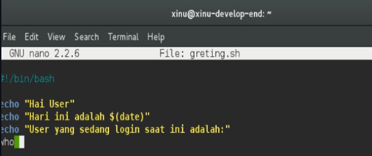 
b. Buatlah script pada greeting.sh sehingga:
   i. Dapat menyapa user
   ii. Menampilkan tanggal hari ini
   iii. Menampilkan user yang sedang login saat ini

  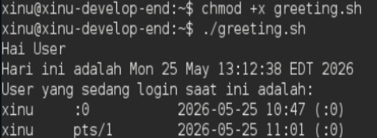 

   - date → menampilkan tanggal dan waktu
   - who → menampilkan user yang login

### 2. PENGONDISIAN

a. Buatlah file bernama greeting_1.sh sesuai dengan template code.

  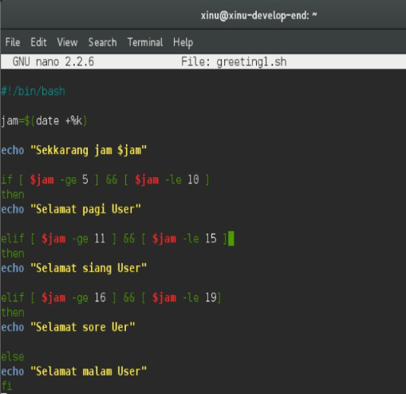 

b. Buatlah script pada greeting_1.sh sehingga dapat menampilkan “selamat pagi” pada
pagi hari (05:01-10:00), “selamat siang” pada siang hari (10:01-15:00), “selamat sore”
pada sore hari (15:01-19:00) “selamat malam” pada malam hari (19:01-05:00).

  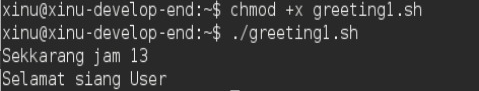 

   Script mengecek jam saat ini lalu menampilkan salam sesuai waktu.

  ### 3. PERULANGAN

a. Buatlah file bernama countdown.sh sesuai dengan template code.

  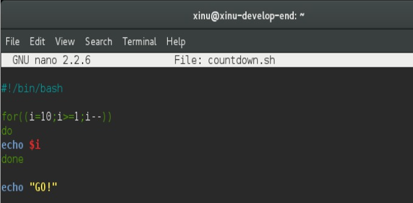 

b. Buatlah script sehingga menghasilkan countdown dimulai dari angka 10 hingga angka 1 lalu diikuti tulisan “GO!”.

  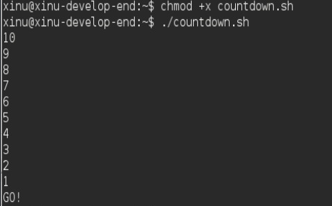 

### 4. INPUT PENGGUNA

a. Buatlah file bernama countdown_1.sh sesuai dengan template code.

  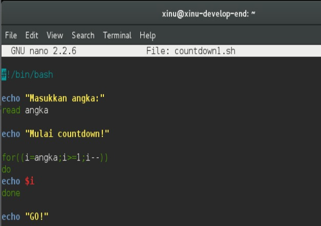 

b. Buatlah script sehingga menghasilkan countdown berdasarkan masukan dari user.

  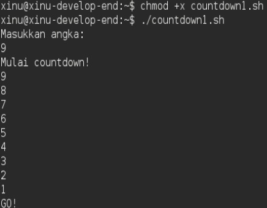 

### 5. PARAMETER SCRIPT

a. Buatlah file bernama countdown_2.sh sesuai dengan template code.

  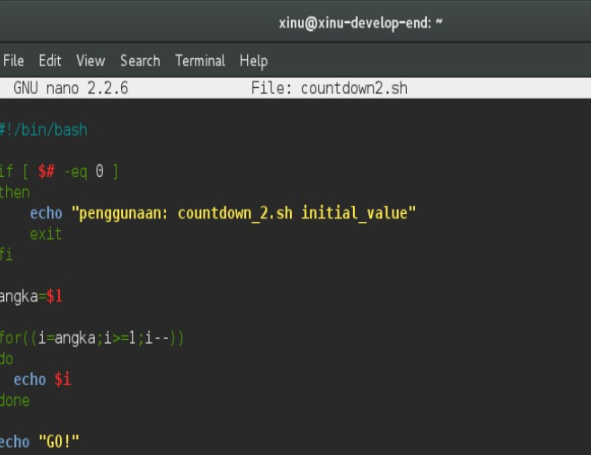 

b. Buatlah script sehingga menghasilkan countdown berdasarkan parameter script.
Pastikan kondisi-kondisi lain ditangani.

  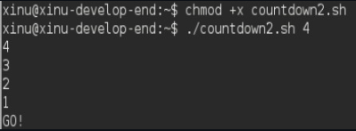 

### 6. PENGONDISIAN (FOR, DIRECTORY)

a. Buatlah file bernama list_direktori.sh. Jangan lupa untuk mengubah ijin script
sehingga dapat dieksekusi.

  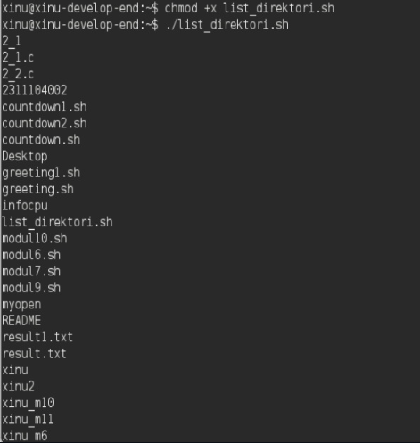 
   
b. Buatlah script sehingga menampilkan semua file pada direktori tersebut.
   
   
