# <h1 align="center">Laporan Praktikum Modul 15    Keamanan Linux </h1>

NOVITA SYAHWA TRI HAPSARI - 2311104007

# Dasar Teori GPG

## a. Pengertian GPG (GNU Privacy Guard)

GPG atau **GNU Privacy Guard** merupakan implementasi perangkat lunak dari standar **OpenPGP (RFC 4880)**. Perangkat lunak ini digunakan untuk melindungi komunikasi dan data melalui proses enkripsi serta pembuatan tanda tangan digital.

GPG dikembangkan sebagai alternatif perangkat lunak enkripsi berbayar dengan menawarkan solusi yang bersifat **open-source**, aman, dan dapat digunakan secara bebas.

## b. Kriptografi Kunci Publik (Asimetris)

Berbeda dengan kriptografi simetris yang menggunakan satu kunci yang sama untuk proses enkripsi dan dekripsi, GPG menerapkan sistem **Kriptografi Kunci Publik** atau **Kriptografi Asimetris**.

Sistem ini menggunakan sepasang kunci yang saling berkaitan, yaitu:

- **Kunci Publik (Public Key)**  
  Kunci yang dapat dibagikan kepada siapa saja. Kunci publik digunakan oleh pengirim untuk mengenkripsi pesan yang ditujukan kepada pemilik kunci.

- **Kunci Privat (Private Key)**  
  Kunci yang wajib dijaga kerahasiaannya dan hanya boleh dimiliki oleh pemiliknya. Kunci privat digunakan untuk mendekripsi pesan yang sebelumnya dienkripsi menggunakan kunci publik yang sesuai.

## c. Konfidensialitas dalam Kriptografi Kunci Publik

Konfidensialitas dalam keamanan informasi merupakan upaya untuk memastikan bahwa suatu informasi hanya dapat diakses oleh pihak yang memiliki hak atau wewenang.

Dalam praktikum ini, GPG menjaga konfidensialitas melalui alur berikut:

1. Pengirim mengenkripsi pesan menggunakan **kunci publik penerima**.
2. Pesan yang telah terenkripsi hanya dapat dibuka atau didekripsi menggunakan **kunci privat penerima** yang sesuai.
3. Meskipun pesan berhasil disadap selama proses pengiriman, pihak penyadap tidak dapat membaca isinya karena tidak memiliki kunci privat yang dibutuhkan.

## d. Export, Import, Enkripsi, dan Dekripsi

- **Export**  
  Proses mengeluarkan dan membagikan kunci publik dalam bentuk file, biasanya menggunakan ekstensi `.asc`, agar dapat digunakan oleh pihak lain.

- **Import**  
  Proses memasukkan kunci publik milik pihak lain ke dalam *keyring* lokal pada sistem sehingga kunci tersebut dapat digunakan untuk mengenkripsi pesan yang ditujukan kepada pemiliknya.

- **Enkripsi**  
  Proses mengubah data asli atau *plaintext* menjadi data terenkripsi atau *ciphertext* sehingga tidak dapat dibaca tanpa kunci yang sesuai.

- **Dekripsi**  
  Proses mengubah data terenkripsi atau *ciphertext* kembali menjadi data asli atau *plaintext* menggunakan kunci privat yang tepat.

## B. Guided
### Persiapan Environment (Instalasi Ubuntu/WSL)
Karena *environment* Ubuntu pada VirtualBox sudah dihapus, instalasi dilakukan menggunakan Windows Subsystem for Linux (WSL) dengan langkah-langkah berikut :
1. Klik tombol **Windows**, ketik `PowerShell`.
2. Klik kanan pada **Windows PowerShell** lalu pilih **Run as Administrator**.
3. Ketik perintah berikut untuk menginstal Ubuntu, lalu tekan Enter: wsl --install -d Ubuntu
4. Setelah selesai proses nya kita diminta buat password dan username (lenovo) 
5. Masuk ke direktori home dan buat folder kerja praktikum dengan nama dan NIM, lalu masuk ke dalam folder tersebut :
    cd ~
   
   mkdir Novita_2311104007
   
   cd Novita_2311104007

   Hasil :

    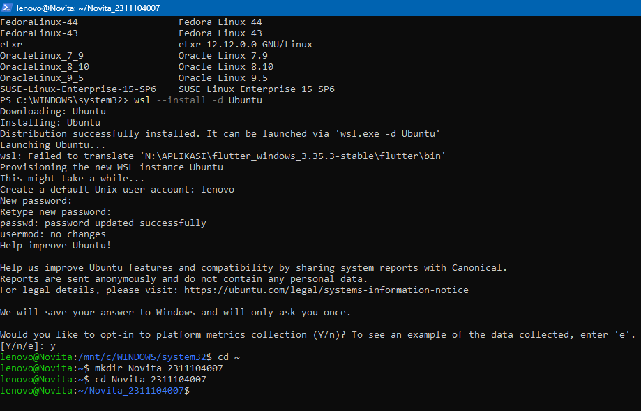
   
## C. Unguided

### 1. Integritas: dasar hashing 

a.  Lakukan hash SHA256, SHA512 dan MD5 untuk file /etc/passwd. Berapa nilai hash dari file /etc/passwd? Screenshot nilai hash dari file tersebut.

sha256sum /etc/passwd => sha512sum /etc/passwd => md5sum /etc/passwd
 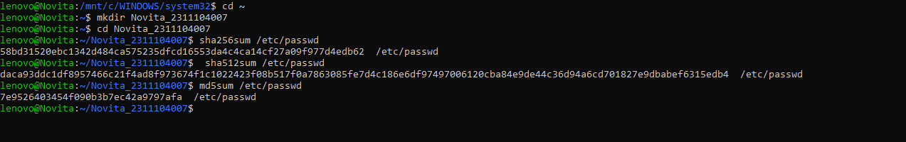
 
b. Buatlah file bernama test_0.txt pada folder /home/praktikan. Isi file tersebut isi yang ada di file /etc/passwd (copy paste isi file /etc/passwd ke test_0.txt)

cp /etc/passwd test_0.txt

 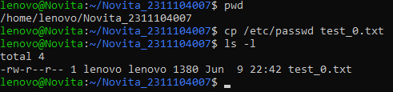
 
c. Lakukan hash SHA256, SHA512 dan MD5 untuk file test_0.txt. Berapa nilai hash dari file test_0.txt? Screenshot nilai hash dari file test_0.txt.

sha256sum test_0.txt => sha512sum test_0.txt => md5sum test_0.txt

 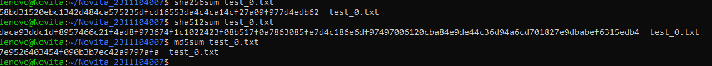
 
d.  Rename file test_0.txt menjadi file_0.txt. Lakukan hash SHA256, SHA512 dan MD5 untuk file_0.txt. Berapa nilai hash file_0.txt? Screenshot nilai hash dari file_0.txt.

mv test_0.txt file_0.txt => sha256sum file_0.txt => sha512sum file_0.txt => md5sum file_0.txt

 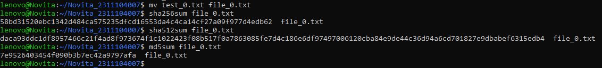
 
e.  Rename file test_0.txt menjadi file_0.txt. Lakukan hash SHA256, SHA512 dan MD5 untuk file_0.txt. Berapa nilai hash file_0.txt? Screenshot nilai hash dari file_0.txt.

- File yang memiliki hash sama: File /etc/passwd, test_0.txt, dan file_0.txt memiliki nilai hash SHA256, SHA512, dan MD5 yang sama persis.
- Penjelasan/Alasan: Nilai hash (sidik jari digital) dihasilkan murni berdasarkan isi atau konten data di dalam sebuah file, bukan berdasarkan nama file atau letak direktorinya. Karena file test_0.txt merupakan hasil copy langsung dari /etc/passwd tanpa modifikasi isi, dan file_0.txt hanya sekadar perubahan nama file, maka isi teks di dalam ketiga file tersebut 100% identik sehingga nilai hash-nya tidak berubah sama sekali.

### 2. Integritas: avalance

a&b. Download file bernama test_1.txt di link ini tiny.cc/test1_txt dan Lakukan hash SHA256, SHA512 dan MD5 untuk file test_1.txt. Berapa nilai hash test_1.txt? Screenshot nilai hash dari file test_1.txt.

sha256sum test_1.txt => sha512sum test_1.txt => md5sum test_1.txt

 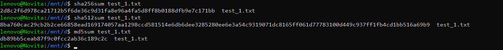
 
c Hapuslah titik diakhir file test_1.txt tersebut, simpan file tersebut!
 
d. Lakukan hash dari SHA256, SHA512 dan MD5. Screenshot nilai hash dari file test_1.txt. 

sha256sum test_1.txt => sha512sum test_1.txt => md5sum test_1.txt

 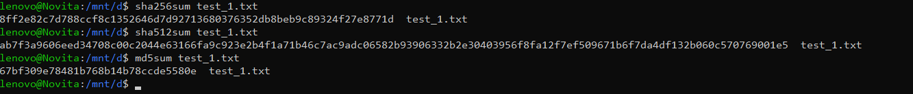
 
e. Apa analisis (hasil pengamatan) Anda mengenai hal tersebut! Apakah nilai hash sama?
- Apakah nilai hash sama? Tidak, nilai hash sama sekali tidak sama. Nilainya berubah total.  
- Analisis (Hasil Pengamatan): Hal ini membuktikan terjadinya prinsip Avalanche Effect pada algoritma hashing. Meskipun data yang diubah pada file sangatlah kecil (hanya menghapus 1 buah karakter titik / 1 byte data), hasil dari fungsi hash (baik SHA256, SHA512, maupun MD5) akan menghasilkan deretan karakter yang berubah secara drastis dan acak. Fungsi ini sangat krusial dalam keamanan sistem untuk memverifikasi integritas sebuah file, karena modifikasi sekecil apa pun yang dilakukan (baik sengaja maupun tidak sengaja) akan langsung terdeteksi karena nilai hash-nya tidak lagi identik dengan file aslinya

### 3. Integritas: avalance

a&b. Download file bernama test_1.doc di link ini tiny.cc/test1_doc dan Lakukan hash SHA256, SHA512 dan MD5 untuk file test_1.doc. Screenshot nilai hash dari file test_1.doc. 

sha256sum test_1.doc => sha512sum test_1.doc => md5sum test_1.doc

 
 
c. Buka kembali file test_1.doc. Lakukan hal ini:

 
 
   i. Ketik abcdef. Save test_1.doc 
   ii. Hapus abcdef. Save test_1.doc 

d. Lakukan hash SHA256, SHA512 dan MD5 untuk file test_1.doc. Screenshot nilai hash dari file test_1.doc. 

sha256sum test_1.doc => sha512sum test_1.doc => md5sum test_1.doc

 
 
e. Hasil pengamatan apa yang diperoleh? Jelaskan alasannya! 

- Hasil Pengamatan yang Diperoleh : Berdasarkan praktikum yang dilakukan, nilai hash dari file `test_1.doc` sebelum dimodifikasi dan sesudah dimodifikasi ternyata **berbeda total**, meskipun isi teks di dalam dokumen tersebut sudah dikembalikan sama persis seperti keadaan aslinya (teks "abcdef" dihapus kembali).
- Penjelasan dan Alasannya : Hal ini terjadi karena file berformat dokumen (`.doc`) menyimpan yang namanya **Metadata** (data tersembunyi di dalam file). Metadata ini mencakup informasi seperti jam berapa file tersebut terakhir diedit atau di-save (*Date Modified*). Ketika kita menambahkan teks lalu menyimpannya, kemudian menghapusnya dan menyimpannya lagi, sistem otomatis memperbarui metadata jam penyimpanannya. Karena fungsi *hashing* (SHA256, SHA512, MD5) mendeteksi dan menghitung seluruh isi file termasuk metadatanya, maka perubahan jam penyimpanan (*Date Modified*) tersebut akan langsung merubah hasil nilai hash secara keseluruhan.

### 4. Konfidensialitas: encfs

Encfs adalah tool untuk melakukan mount dan membuat file system yang terenkripsi. Cara kerjanya adalah sebagai berikut. Ada 2 folder yang akan dibuat, dua folder tersebut saling terkait. Satu folder merupakan folder yang tidak terenkripsi, folder lainnya merupakan hasil enkripsi dari folder pertama.

a. Jalankan perintah berikut : encfs ~/folder_anda/folder_terenkripsi ~/folder_anda/folder_normal

Pilih y (enter), pilih y (enter), enter, kemudian buatlah password. Ingatlah password yang dibuat. Setelah selesai, perhatikan bahwa telah muncul folder bernama folder_normal dan folder_terenkripsi.

- Langkah awal adalah melakukan instalasi aplikasi `encfs` dan melakukan inisialisasi folder terenkripsi serta folder normal untuk membuat sistem berkas terenkripsi (*encrypted volume*).
- Perintah : encfs ~/Shilfi_2311104002/folder_terenkripsi ~/Shilfi_2311104002/folder_normal

 
 
b. Copy dua atau tiga buah file (file apa saja) ke folder_normal. Amati dan tulis hasil observasi Anda pada folder_terenkripsi! 

Hasil Observasi : Ketika dilakukan pengecekan pada folder_terenkripsi menggunakan perintah ls folder_terenkripsi, nama file yang muncul telah berubah menjadi deretan karakter acak (ciphertext). Hal ini membuktikan bahwa sistem EncFS bekerja secara real-time untuk melakukan enkripsi pada saat file dimasukkan ke dalam folder yang telah di-mount.

 
 
c.  Hapus salah satu file (bebas) pada folder_terenkripsi. Amati dan tulis hasil observasi Anda pada folder_normal!

Hasil Observasi: File asli yang bersesuaian di dalam folder_normal ikut terhapus. Hal ini terjadi karena folder_normal hanyalah antarmuka (interface) yang terhubung langsung dengan folder_terenkripsi (backend). Penghapusan data di salah satu sisi akan berdampak langsung pada sisi lainnya.

 
 
d.  Lakukan umount dengan perintah : Fusermount -u ~/folder_anda/folder_normal
Amati dan tulis hasil observasi Anda pada folder_normal dan folder_terenkripsi

Hasil Observasi: Setelah proses unmount, folder_normal menjadi kosong. Data tidak dapat diakses secara langsung tanpa proses mount ulang menggunakan password yang valid.

 
 
e. Buatlah folder baru bernama folder_sembarang. Lakukan perintah berikut ini : encfs ~/folder_anda/folder_terenkripsi ~/folder_anda/folder_sembarang
Amati dan tulis hasil observasi Anda!

Hasil Observasi: Setelah memasukkan password yang benar, file yang tersimpan di dalam brankas (folder_terenkripsi) berhasil didekripsi dan muncul kembali di dalam folder_sembarang dengan nama asli. Hal ini menunjukkan bahwa sistem enkripsi EncFS aman dan fleksibel untuk digunakan.

 
 
### 5. Konfidensialitas: gpg

a. Membuat kunci publik dan privat. Jalankan perintah ini 

- Tujuan: Membuat pasangan kunci (publik dan privat) untuk keperluan enkripsi dan dekripsi pesan.
- Langkah: Menjalankan perintah gpg --gen-key dan mengikuti instruksi interaktif yang diberikan sistem, termasuk memasukkan identitas diri.
- Bukti: 
 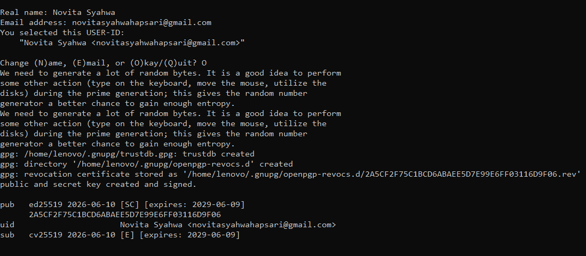

b. Hasil publickey dan privatekey ada di folder ~/.gnupg. Privatekey tidak boleh keluar dari komputer ini dan hanya Anda saja yang dapat mengaksesnya. Kunci publik akan dibagikan kepada seluruh dunia atau untuk orang yang Anda inginkan saja. Kunci publik adalah pubring.gpg dan kunci private adalah secring.gpg
Lakukan perintah berikut ini untuk mengetahui daftar key yang Anda punya dan fingerprint kunci yang Anda punya!

- Tujuan: Memverifikasi daftar kunci yang sudah dimiliki dan melihat nilai fingerprint sebagai tanda pengenal unik kunci tersebut.
- Langkah: Menjalankan perintah gpg --list-keys dan gpg --fingerprint [email_kamu].
- Bukti: 

 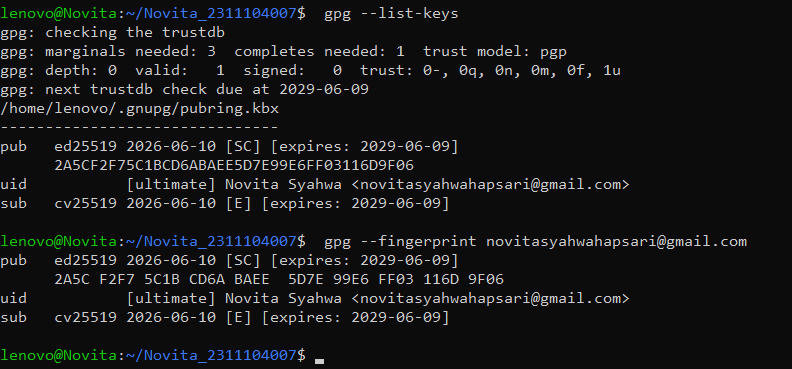
 
c.  Jalankan perintah ini : gpg –-armor –-export nama@email.anda > mypublic_key.asc
File mypublic_key.asc adalah file yang akan dibagikan kepada teman-teman Anda. Teman Anda akan menggunakan kunci publik Anda jika ingin mengirim pesan rahasia kepada Anda. Hanya Anda yang dapat membaca pesan tersebut karena hanya mempunyai kunci privat yang bersesuaian dengan kunci publik Anda. 

- Tujuan: Mengonversi kunci publik ke format .asc agar bisa dibagikan kepada rekan praktikan lain.
- Langkah: Menjalankan perintah gpg --armor --export [email] > [NIM].asc. File kemudian di-rename menjadi [NIM].asc.
- Catatan Teknis: Terdapat kendala teknis pada link pengumpulan folder Google Drive, di mana tidak ditemukan folder yang sesuai dengan kelas SE0701, sehingga file dibagikan secara lokal untuk kebutuhan praktikum.
- Bukti: 

 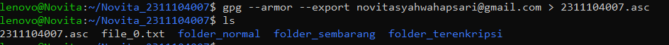
 
d. Mengimport kunci publik orang lain. Silakan download file nim_teman_sebelah_anda.asc dan jalankan perintah ini untuk mengimport (menambahkan kunci publik orang lain ke sistem Anda) : gpg –-import nim_teman_sebelah_anda.asc

- Tujuan: Menambahkan kunci publik rekan praktikan ke dalam sistem GPG lokal agar dapat melakukan enkripsi pesan kepada mereka.
- Langkah: Mengunduh kunci publik teman (contoh: 103012440018.asc) dan menjalankan perintah gpg --import 103012440018.asc.
- Bukti: 

 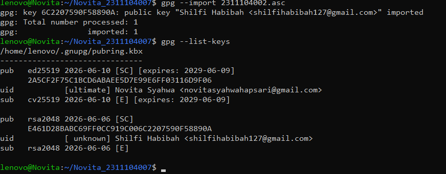
 
e. Buatlah file bernama file_rahasia.txt. Isi file tersebut dengan pesan rahasia Anda. Pesan inilah yang akan Anda kirim ke teman Anda. Jalankan perintah ini untuk melakukan enkripsi : //ditulis dalam satu baris
gpg –-encrypt –-armor -r alamat_email_teman_anda_yang_baru_diimport@xxx.com file_rahasia.txt

- Tujuan: Mengamankan pesan rahasia sehingga hanya pemilik kunci privat yang dituju yang dapat membukanya.
- Langkah: Membuat file pesan.txt dengan perintah echo, kemudian menjalankan perintah gpg --encrypt --recipient [email_teman] pesan.txt.
- Catatan: Muncul peringatan "There is no assurance this key belongs to the named user", yang menandakan kunci publik belum ditandatangani (signed). Proses dilanjutkan dengan mengonfirmasi pilihan "y" untuk melanjutkan enkripsi.
- Bukti: 

 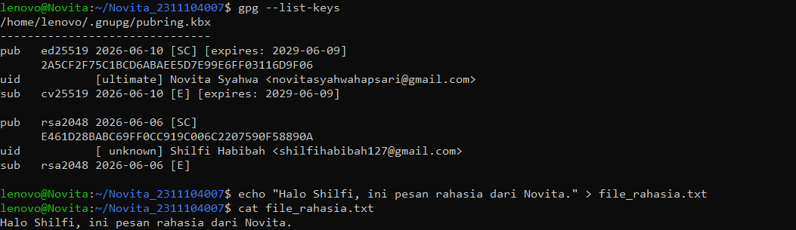
 
f.  Hanya teman anda yang dapat membuka file tersebut. Hasil dari proses tersebut adalah file_rahasia_untuk_teman_anda.asc (contoh: file_rahasia_untuk_130118yyyy.asc) Taruh file_rahasia_untuk_teman_anda.asc ke folder pada link: http://tiny.cc/SisopNomor5F
Download dan buka file yang diperuntukkan bagi Anda dan lakukan dekripsi untuk melihat isi pesan dengan perintah : pg file_rahasia_nim_anda.asc

- Tujuan: Membuka file terenkripsi untuk membaca pesan rahasia menggunakan kunci privat yang sesuai.
- Langkah: Melakukan dekripsi file dengan perintah gpg -d pesan.txt.gpg > hasil_buka_pesan.txt, kemudian membaca isi file dengan cat hasil_buka_pesan.txt.
- Catatan: Dekripsi dilakukan untuk menguji validitas enkripsi. Proses ini berhasil mengembalikan pesan ke format teks asli, yang membuktikan bahwa kunci privat yang digunakan sesuai dengan kunci publik saat enkripsi.

 
